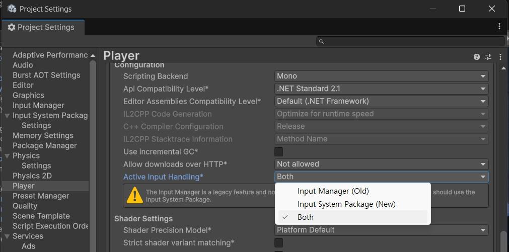
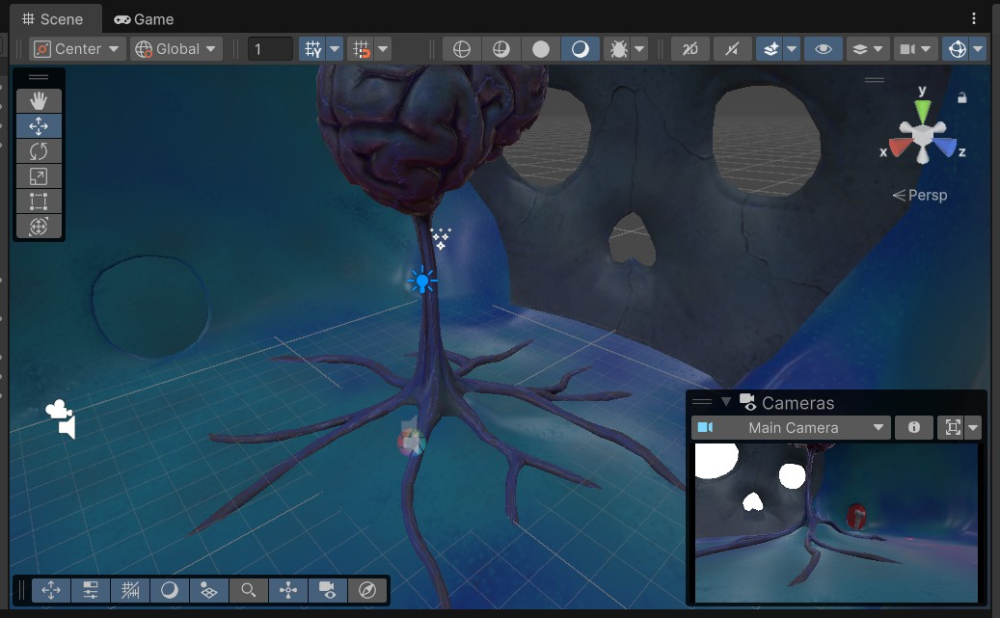
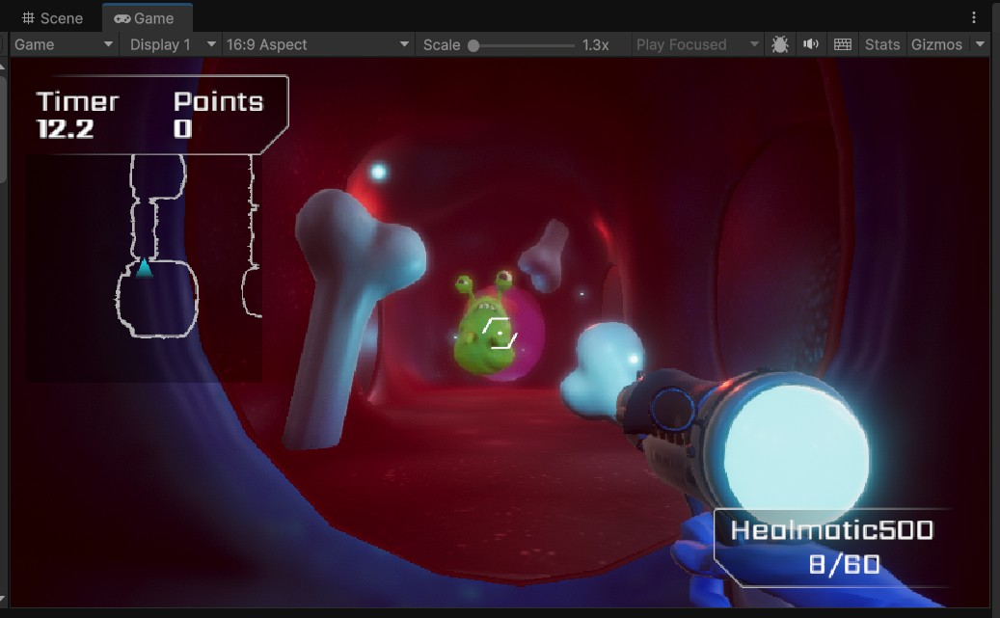

# FPS Creater Kit

## 개요

- Unity Learn, https://learn.unity.com/course/creator-kit-fps?version=2022.3 에서 따라할 수 있는 예제

### 문제점

- Unity 6.0으로 프로젝트 생성 후
- Asset을 불러와,
- Example Scene을 로드, 플레이를 진행하면 키보드 입력 안됨

### 해결방법

- Edit > Project Settings... 에서
- Player 선택
- 하위 Other Settings 아래
- Active Input Handling 변경

- 재시작 후 다시 플레이

## 튜토리얼 진행

### 게임 레벨만들기

- https://learn.unity.com/course/creator-kit-fps/tutorial/customize-the-germ-targets?version=2022.3 에서 시작

