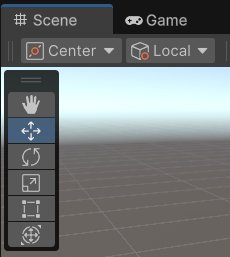
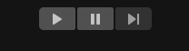
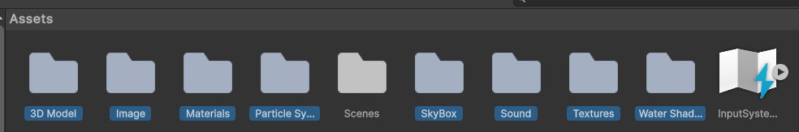
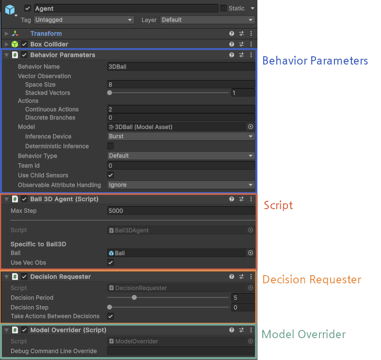

# hugo-unity
유니티 학습 리포지토리

## 유니티 기본 학습

### 인터페이스

- 인터페이스 설명

    

    - Center/Pivot 
        - Center : 여러 개의 오브젝트를 선택했을 때, `전체의 중심`을 기준으로 조작
        - Pivot : 각 오브젝트의 피벗, 즉 원래 설정된 중심점을 기준으로 이동/회전/스케일 조작

    - Local/Global
        - Local : 오브젝트 자체의 로컬 좌표계를 기준으로
        - Global : 월드 좌표게 기준으로

    - 손모양 부터 아래로
        - View Tool : (손모양)화면이동 (Q)
        - Move Tool : 오브젝트 이동 (W)
        - Rotate Tool : 오브젝트 회전 (E)
        - Scale Tool : 오브젝트 크기 (R)
        - Rect Tool : 2D 오브젝트나 UI요소에 사용 (T) 
        - Transform Tool : 이동+회전+스케일을 하나로 통합한 툴 (Y)

- 다음 인터페이스

    

    - Play : 게임 실행(Ctrl + P)
    - Pause : 게임 일시정지 (Ctrl + Shift + P)
    - Step : 1스텝 실행(Pause일 경우) (Ctrl + Alt + P)

- 키보드 단축키

    - F : 선택 오브젝트 포커스 인

### 서바이벌 FPS 클로닝

1. 프로젝트 생성 후
2. Assets에 필요 에셋 붙여넣기

    

3. 3D Object > Plane 추가

4. 3D Object > Capsule 추가 후 Main Camera를 Capsule을 이름 바꾼 Player에 추가
    - Player의 Position Y도 1로 변경
    - Main Camera의 Transform을 Reset 후 Position Y를 1로 변경
    - Player의 Add Component로 RigidBody 추가

5. Assets 아래에 Scripts 폴더 생성
    - PlayerController.cs 생성
    - VS에서 작성

6. Unity Editor에서 Player에 PlayerController.cs 드래그


### 유니티를 이용한 하이브리드 캐주얼게임 클로닝


### Unity ML-Agents
- Unity Machine Learning Agents Toolkit(ML-Agents)은 게임과 시뮬레이션을 지능형 에이전트 훈련 환경으로 활용할 수 있도록 하는 오픈소스 프로젝트
- PyTorch 기반의 최첨단 알고리즘 구현을 제공하여 게임 개발자와 취미 개발자들이 2D, 3D 및 VR/AR 게임용 지능형 에이전트를 쉽게 훈련할 수 있도록 지원

#### ML-Agents 다운로드
- https://github.com/Unity-Technologies/ml-agents
- ML-Agents Release 22 다운로드

#### Python 가상환경 활성화
- Python 3.10 버전에 맞추기
- 파이썬 가상환경

    ```shell
    > python -m venv mlagent-env
    > pip install mlagents
    ```

- 확인

    ```shell
    > pip show mlagents
    ...
    > pip show mlagents-envs
    ...
    ```

#### Unity Hub
- Add > Add project from disk 선택
- {압축경로}\ml-agents-release_22\Project 선택
- 자신의 Unity버전에 맞게 변경 오픈
- ML-Agents 플러그인 적용
    - Menu Window > Package Manager > 왼쪽 상단 + > Install package from disk...
    - com.unity.ml-agents / com.unity.ml-agents.extensions 의 package.json 파일 선택
    

## 유니티 런
- https://unity.com/kr/learn/get-started

### 따라하기

[링크](./unitylearn/README.md)


## 유니티 강화학습

### 강화학습 이론
- 기계학습의 종류
    - 지도학습, 비지도학습, `강화학습(Reinforcement Learning)`

- 강화학습의 예시
    - 에이전트와 환경 : 자전거를 처음 배우는 사람과 자전거를 타는 환경
    - 패널티 : 넘어지거나 충돌이 발생하면 패널티
    - 보상 : 자전거를 잘타면 보상
    - 다수의 시도를 통ㅎ애 점점 넘어지지 않고 자전거 타는 것이 성공하도록 반복 학습

- 강화학습 적용분야
    - 자율주행, 금융, 게임, 로봇, 드론 등에 적용 가능

### 기초 용어
- MDP(Markov Decision Process)
    - 순차적으로 행동을 결정하는 문제를 풀기 위한 기법
    - 상태(s), 행동(a), 보상함수(R/a/s), 상태변환확률(P/a/ss), 감가율(γ)
- Agent
    - 강화학습에서 의사결정을 하는 역할. 제어의 대상이 되는 주인공
- Environment
    - 에이전트의 의사결정을 반영하고, 에이전트에게 정보를 주는 시스템
    
- Observateion
    - 관측. 환경에서 제공하는 정보
- State
    - 상태. 에이전트는 상태를 기반으로 의사경정을 수행
- Action
    - 행동. 에이전트가 의사결정을 통해 취할 수 있는 행동
- Step & Episode
    - 스텝. 에이전트가 한번 행동을 취함
    - 에피소드. 게임 한판이 끝남
- Policy
    - 정책. 특정상태에서 취할 수 있는 행동을 선택할 확률분포
- State Transiiton Function
    - 상태 변환 확률. 상태에서 행동을 했을 때 다음상태가 될 확률
- Reward Function
    - 보상함수. 에이전트는 특정상태에서 특정행동을 했을 때 이에 해당하는 보상을 받음

- ... 생략
- Bellman Equation
    - 벨만 방정식. 현재 상태의 가치함수와 다음 상태의 가치함수 사이의 관계를 나타낸 식


### ML-Agents 설치
- 생략

### 3D Ball
- 머리위의 공이 떨어지지 않도록 박스헤드를 제어하는 환경

    https://github.com/user-attachments/assets/f3bd2126-c04c-4fde-8d89-497d64e43e68


- 12개의 동일한 3DBall 객체로 구성
- 각 객체는 아래와 같이 구성 
    - Ball
    - Agent
        - AgentCube_Blue
            - AgentCamera
            - eye
            - eye
            - mouth
            - Headband

- 하위 Agent에서의 ML-Agents 요소들

    

    - **Behavior Parameters** : 핵심 설정 컴포넌트. 관측/행동 스펙과 모델 지정
        - `Behavior Name` - 에인전트 행동 이름. Python측 config.yaml 파일과 매칭되어야 함
        - `Vector Observation` - 수자벡터로 에이전트 환경을 관찰
            - `Space Size` - 에이전트가 한 시점에 관찰하는 float값의 개수
            - Stacked Vectors - 이전 관측 프레임들을 몇 개까지 누적할 것인지 설정
        - `Actions` - 학습 결과로 얻은 행동(action) 값을 환경에 적용
            - `Continuous Actions` - 실수(float) 범위의 연속적인 값
            - `Descreate Branches` - 정수(int) 중 하나를 선택하는 분류 방식
        - `Model` - .onnx 파일 연결. 훈련된 모델을 여기 연결하면 추론모드에서 사용
            - Inference Device - 추론시 사용할 디바이스. 
            - `Deterministic Inference` - 항상 같은 입력에 대해 같은 행동을 하도록 만들 것인지 여부
        - `Behavior Type` - Default(훈련또는 추론), Heuristic Only(사람이 제어), Inference Only(훈련된 모델만) 중 선택
        - Team Id - 에이전트가 속한 팀 번호
        - Use Child Sensors - Sensor 컴포넌트들까지 자동으로 활성화할지 여부
        - Observable Attribute Handling - 자동으로 관측 정보를 수집할 것인지 여부
    - Ball 3D Agent(Script) : 스크립트에서 학습 행동 정의
        - `Max Step` - 한 에피소드에서 에이전트가 행동할 수 있는 최대 Step 수
        - Specific to Ball3D - 이 항목은 실제로 존재하지 않는 값
        - Ball - 공 오브젝트 (Ball 또는 Sphere 등)를 가리키는 참조 변수
        - Use Vec Obs - 벡터 관측 사용 여부를 켜고 끌 수 있는 Boolean 스위치
    - Decision Requester : 매 프레임 판단 요청 자동화
        - Script - 사용자 설정과는 관계없는 Unity의 내부 표시 용도
        - `Decision Period` - 몇 프레임마다 판단(decision)을 요청할지. 1(매프레임마다), 5(5프레임마다)
        - Decision Step - 현재 스텝이 몇 번째 decision 스텝인지(읽기전용)
        - `Take Actions Between Decisions` - 판단이 없는 프레임에서도 에이전트가 이전 행동을 계속 수행할지 여부
    - Model Overrider(Script) : 실험적 모델 덮어쓰기
        - Script - 
        - Debug Command Line Override - 외부에서 모델(.onnx) 경로를 덮어씌울 수 있는 옵션

- Ball3DAgent 스크립트

    ```cs
    public void SetBall()
    {
        //Set the attributes of the ball by fetching the information from the academy
        m_BallRb.mass = m_ResetParams.GetWithDefault("mass", 1.0f);
        var scale = m_ResetParams.GetWithDefault("scale", 3.0f); // 공 크기
        ball.transform.localScale = new Vector3(scale, scale, scale);
    }
    ```

    https://github.com/user-attachments/assets/b908624c-bc3a-4a63-9036-82d762fc055c


    - 공이 작으면 없었던 머리 밖으로 넘어가 떨어지는 현상 발생


### 환경빌드
- File > Build Profiles 클릭
    - Scene List에 원하는 신 선택
    - Windnows 기본 설정에 Build And Run 클릭 후 폴더 선택

    
