# Unity-Robotics-Hub 클로닝

## 전체 로드맵

1. ROS 쪽 워크스페이스 준비 (서버)
2. Unity 프로젝트 열기 + 패키지(ROS-TCP-Connector, URDF Importer) 준비
3. 로봇 URDF 임포트해서 씬 만들기
4. ROS–Unity TCP 통신 붙이기(메시지 생성 포함)
5. Pick-and-Place 동작 실행/확장

### Niryo One

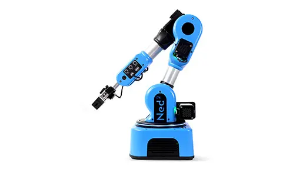

- 프랑스 회사 Niryo가 만든 교육·연구용 6축 로봇팔
- Unity-Robotics-Hub 튜토리얼에서 표준 예제 로봇으로 사용됨


### 튜토리얼 순서의 의미

- ROS(Docker): 로봇의 두뇌 구성
- Unity: 로봇의 몸 + 눈 + 물리 세계
- URDF: 그 둘을 연결하는 로봇 설계도

## 순서 따라하기

### 필요 설정

- Unity (가급적 2020+ 권장)
- ROS 환경(리눅스 권장: Ubuntu / Docker / WSL2 등)
- Git

### 레포 클론

```bash
git clone https://github.com/Unity-Technologies/Unity-Robotics-Hub.git
cd Unity-Robotics-Hub
```

### ROS 워크스페이스 세팅 (가장 안전한 건 Docker)

A안) Docker(추천)

- 장점: 버전 꼬임/의존성 지옥을 많이 회피
- 단점: Docker에 익숙해야 함

튜토리얼 문서 흐름 그대로 따라가면 됩니다.

B안) 수동(catkin)

- 장점: ROS 구조를 제대로 배움
- 단점: 삐끗하면 삽질이 “우주왕복선급”으로 커짐

#### A안

- ROS를 내 PC에 직접 설치하지 않고, Docker 컨테이너 안에 ‘완성된 ROS 실습 환경’을 통째로 띄운다
- 교육용 표준 환경을 가정합니다.
- 문제는 ROS가:
    - OS 의존성이 강하고
    - 버전(ROS1/ROS2) + Ubuntu 버전에 민감하고
    - 한 번 꼬이면 복구가 힘들다는 점

그래서 공식 튜토리얼에서도 **“가능하면 Docker”**를 먼저 제시합니다.

#### 준비물 (A안 전용)

1. Docker Desktop 설치
2. Git
3. (OS는 Windows / macOS / Linux 전부 가능)

⚠️ Windows라면
Docker Desktop 설치 시 WSL2 활성화까지 되어 있어야 합니다.

#### Pick-and-Place ROS Docker 폴더로 이동

- 레포 클론한 곳에서 

```bash
cd tutorials/pick_and_place
```

이 폴더 안을 보면:
- `docker/`
- `Dockerfile`
- `docker-compose.yml` (또는 이에 준하는 설정)

같은 파일들이 있습니다.

👉 이게 바로 ROS 서버 쪽 뇌(Brain) 입니다.

#### Docker 이미지 빌드

```bash
cd /PATH/TO/Unity-Robotics-Hub/tutorials/pick_and_place &&
git submodule update --init --recursive &&
docker build -t unity-robotics:pick-and-place -f docker/Dockerfile .
```

- 클론한 경우 맨 첫줄 명령어는 따로 필요없음!
- Windows powershell에서는 && 를 제거하고 각 줄별로 실행할 것

- git submodule update --init --recursive
    - 모든 서브모듈이 
    - 정확한 버전으로 빠짐없이
    - 중첩 구조까지 전부
    - 자동 셋팅완료할 것

- docker build -t unity-robotics:pick-and-place -f docker/Dockerfile .
    - 지금 폴더를 재료로 해서, 지정한 Dockerfile을 써서,
    - `unity-robotics:pick-and-place`라는 이름의 도커 이미지를 만들어

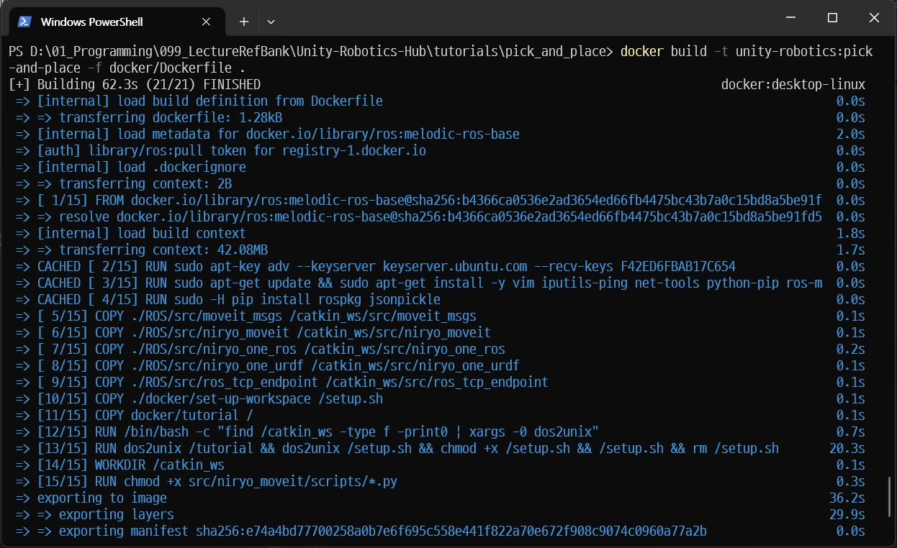

- 도커파일과 빌드에 포함하지 않을 목록(없음)을 읽은 뒤
- 베이스 이미지(기본 OS +ROS)를 로드
- 캐시 히트: 에전 빌드한 단계 재사용
- ROS 패키지를 catkin_ws/src로 복사
- setup 스크립트 & 튜토리얼 파일 복사
- 윈도우 줄바꿈(CRLF) 정리
- 작업 디렉토리 잡고, 스크립트 권한 추가
- 이미지로 내보내기(exporting)

- 특이점 
    - ROS Melodic 기반(ROS 1)
    - 여러 패키지를 한 번에 빌드하고 의존성을 맞추고 실행 환경을 세팅해주는 빌드 시스템이 catkin

    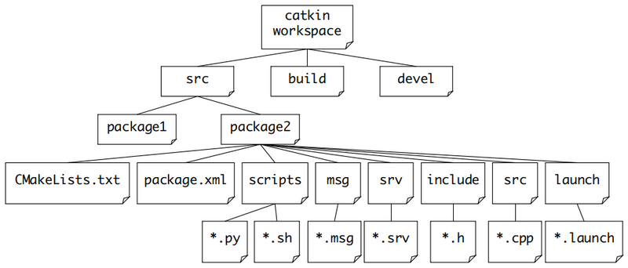

#### 새 도커 컨테이너 실행

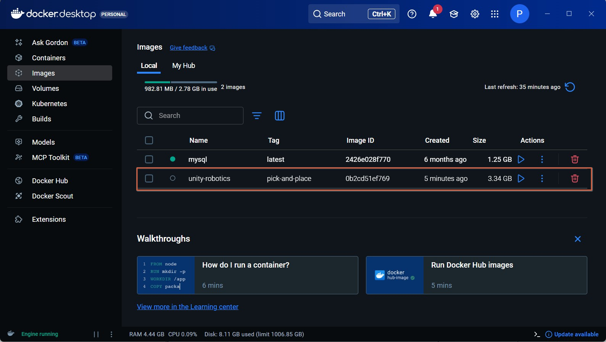

```bash
docker run -it --rm -p 10000:10000 unity-robotics:pick-and-place /bin/bash
```

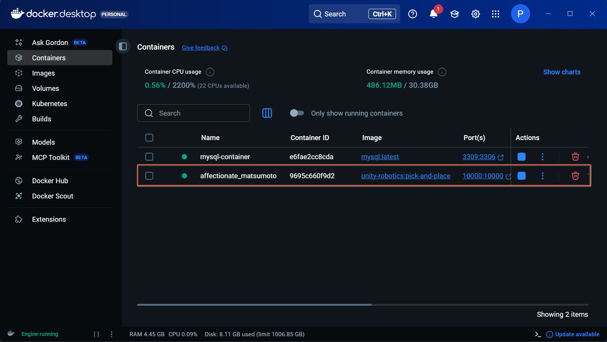

- /bin/bash 를 제거 후 실행하면 컨테이너 실행 후 바로 종료 사라짐


#### 도커 이미지 구성 환경

- Ubuntu Linux
- ROS Melodic
- catkin 워크스페이스 (/catkin_ws)
- Pick-and-Place 튜토리얼에 필요한 ROS 패키지
- Unity와 통신하기 위한 ROS TCP Endpoint 노드

### 유니티 오픈 및 설정

- 선택할 Unity 버전
    - 2020.3.11f1 또는 최신 개발버전 (현재는 2020.3.49f1 사용) 
    - 2021.1.8f1 또는 최신 개발버전
    - 2021.2.a16 또는 최신 개발버전

#### URDF(Unified Robot Description Format)

- Unity 쪽에서 그 설계도를 읽어서 실제로 움직일 수 있는 로봇 GameObject로 바꾸는 단계
- Unity는 기본적으로 URDF를 이해하지 못하므로 URDF Importer 패키지를 사용

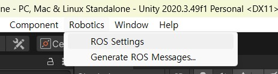

- 프로젝트 오픈
    - `Assets/Scenes/EmptyScene` 을 더블클릭

- `Assets/Prefabs` 에서 테이블 프리팹을 선택 EmptyScene 하이라키에 드래그

#### 패키지 매니저

- Package Manager 열기
    - `Add package from git URL…` 선택
    - 주소 https://github.com/Unity-Technologies/URDF-Importer.git 붙여넣기

    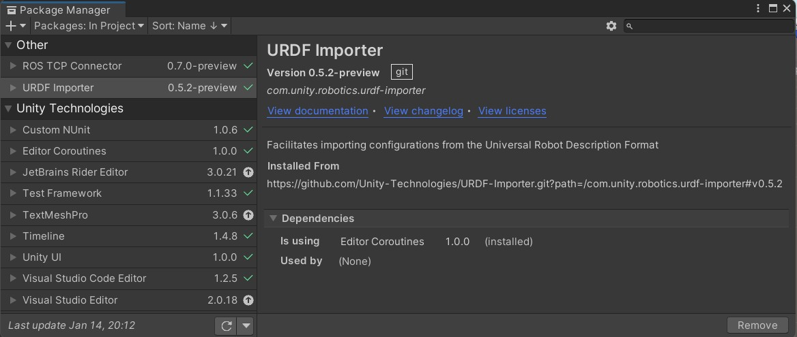

- 설치 오류 시
    - github repo를 다운로드 압축 해제 후 
    - `Add package from git disk` 선택
    - package.json 이 위치한 com.unity.robotics.urdf-importer 까지 진입 선택

    - Project 컨텍스트 메뉴에서

        

    - Import Robot form Selected URDF file 메뉴 확인 (일단 된것으로 간주)


#### 튜토리얼 방식 설정

1. 메인카메라 선택 후,
    - Position `(0, 1.4, -0.7)`
    - Rotation `(45, 0, 0)`

    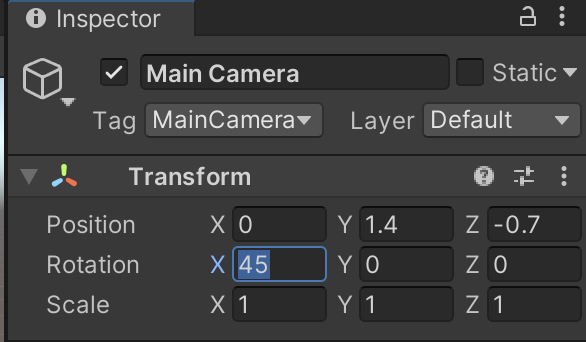

#### 로봇 셋팅

- 로봇이 시뮬레이션에서 올바르게 동작하도록 몇 가지 추가 설정이 필요
- 각 관절에는 Articulation Body 컴포넌트가 추가되어 있어야 함
- 로봇 컨트롤러 스크립트를 사용하여 로봇을 제어

##### 로봇 설정

1. Physics 프로젝트 설정을 오픈
    - (상단 메뉴: Edit > Project Settings > Physics)
    - Solver Type이 `Temporal Gauss Seidel` 인지 확인
    - 기본 솔버로 인해 발생할 수 있는 관절의 불안정한 동작을 방지

    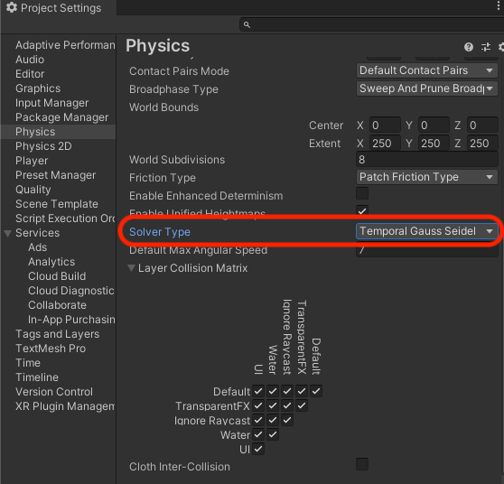


2. Niryo One URDF 불러오기

    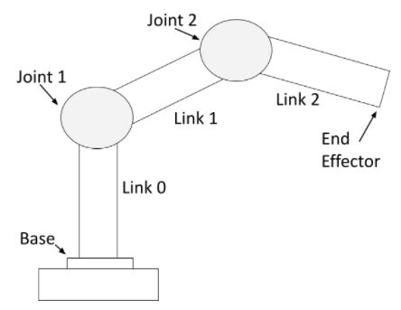

    - URDF 파일 선택

    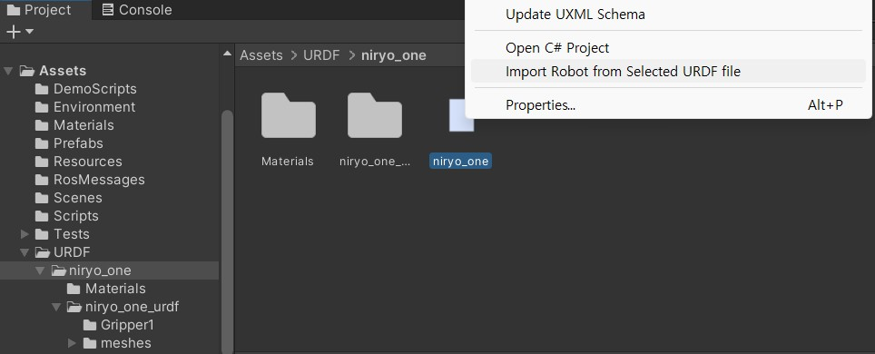

    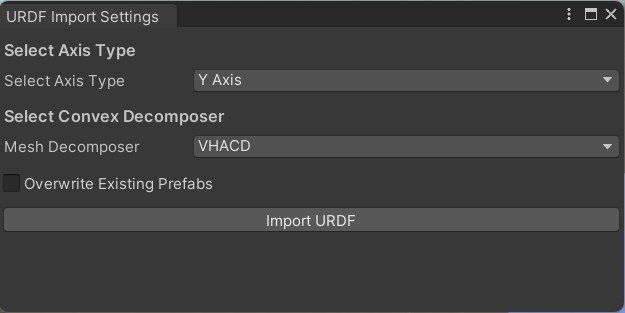

    - Axis Type은 Y축, Z축 두개 옵션
        - 왜 Y Axis인가?
        - Unity의 기본 월드 좌표계는 Y-up, ROS URDF는 기본적으로 Z-up

    - Mesh Decomposer(충돌 게산방식)는 Unity, VHACD(V-HACD : Volumetric Hierarchical Approximate Convex Decomposition) 두 옵션
    - V-HACD는 복잡한 3D 메시를 물리 엔진이 좋아하는 여러 개의 볼록한 부피 덩어리로 계층적으로 근사 분해하는 알고리즘

    - 이후 순서
        1. URDF XML 파싱
        2. link → GameObject 생성
        3. joint → ArticulationBody 생성
        4. mesh → Renderer + Collider 생성
        5. Prefab 생성
        6. 씬에 로봇 배치

    - 결과

        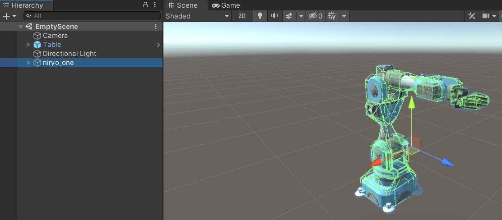

    - 실행하면 로봇팔이 쓰러짐 ^^

        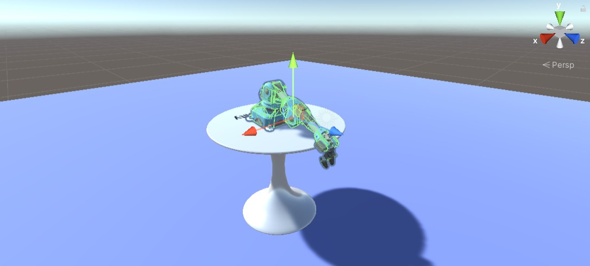

4. Scene Hierarchy에서 새로 임포트된 niryo_one 오브젝트를 선택

    - Inspector 창에서 Controller(스크립트) 컴포넌트를 찾고 다음과 같이 설정
    - Stiffness(견고): 10000
    - Damping(제동): 100
    - Force Limit(힘제한): 1000
    - Speed(속도): 30
    - Acceleration(가속): 10

    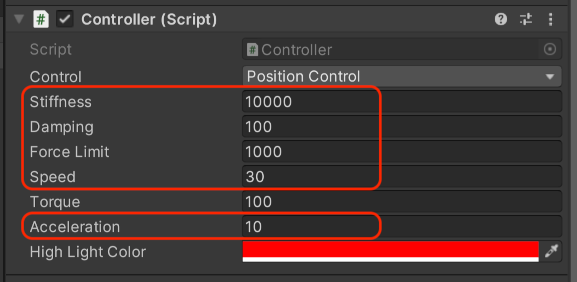

5. Hierarchy 창에서 이름 왼쪽의 화살표를 클릭
    - GameObject 트리를 niryo_one/world/base_link까지 확장.
    - base_link에 대해 Immovable을 활성화 (넘어지지 않음!)

    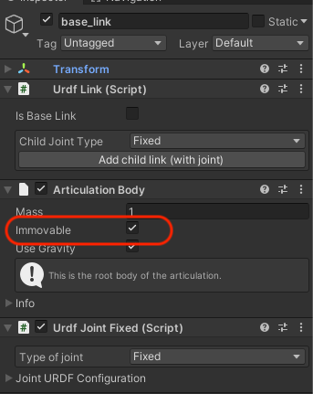

    > Note : Niryo의 움직임을 보여주기 위해 Unity URDF Importer에는 기본 컨트롤러가 포함됨. Controller 스크립트는 임포트된 URDF에 기본적으로 추가되며, 
    > 실행 시 FKrobot 및 Joint Control 컴포넌트를 추가. 이 Controller 스크립트는
    > `Assets/Packages/URDF Importer/Runtime/Controller/Controller.cs`에서 확인

6. Unity Editor 상단의 Play 버튼을 눌러 Play Mode로 진입
    - 모든 것이 올바르게 임포트되었다면 Console 창에 오류 없음
    - 로봇 팔은 테이블에 고정된 상태로 유지, 어떤 오브젝트도 바닥 아래로 떨어지지 않음
    - Controller를 사용하면 화살표 키로 관절을 선택가능.    
    - 좌/우 화살표 키로 관절을 이동하며, 선택된 관절은 빨간색으로 강조 표시.
    - 상/하 화살표 키로 선택된 관절의 움직임을 제어.
    - niryo_one 오브젝트의 Controller 스크립트에는 현재 선택된 Selected Index와 Joint Name이 표시.

#### 문제 해결

- Assets 메뉴에 Import Robot from URDF가 보이지 않는 경우,
    - Console에서 컴파일 오류가 있는지 확인.
    - 에디터 도구는 프로젝트가 정상적으로 컴파일된 이후에만 활성화됨.

- Console 오류는 없지만 로봇이 느슨하거나 흔들리거나 움직이지 않는 경우,
    - niryo_one 오브젝트의 Controller 스크립트에서
    - Stiffness와 Damping 값이 각각 10000, 100으로 설정되어 있는지 확인

### ROS TCP 작업

이번 단게에서 다루는 내용은 다음이 포함됩니다.

- Unity와 ROS 간의 TCP 연결 생성
- ROS 메시지로부터 C# 스크립트 생성
- ROS 토픽을 통한 퍼블리시 및 서브스크라이브

이 단계들은 [ROS–Unity Integration Tutorials](https://github.com/Unity-Technologies/Unity-Robotics-Hub/tree/main/tutorials/ros_unity_integration) 를 기반으로 작성되었습니다.

#### ROS–Unity 통합


##### 간단 설명:

Unity와 ROS 간의 통신을 가능하게 하기 위해, ROS 노드로 실행되는 TCP 엔드포인트가 모든 메시지 전달을 처리합니다.
Unity 측에서는 ROSConnection 컴포넌트가 TCP 엔드포인트 ROS 노드를 사용하여 퍼블리시, 서브스크라이브, 또는 서비스 호출에 필요한 기능을 제공합니다.

Unity와 ROS 사이에서 전달되는 ROS 메시지는 ROS 내부에서 직렬화되는 방식과 정확히 동일하게 직렬화되어야 합니다.
이는 ROS 메시지로부터 C# 클래스(직렬화 및 역직렬화 함수 포함)를 생성하는 MessageGeneration 플러그인을 통해 이루어집니다.


---

#### Unity 측

1. 아직 ROS 워크스페이스 설정을 완료하지 않았거나, Unity 프로젝트 설정을 완료하지 않았다면, 먼저 진행해야 함
2. PickAndPlaceProject Unity 프로젝트를 Unity Hub에서 오픈

    > Project 창에서 Packages/ROS-TCP-Connector가 보이거나 Package Manager 창을 열어 이를 확인할 수 있음

    > ROS-TCP-Connector 패키지는 두 가지 구성 요소를 포함합니다.
    > TcpConnector에는 위에서 설명한 ROSConnection 스크립트가 포함되어 있으며,
    > MessageGeneration은 ROS msg 및 srv 파일로부터 C# 스크립트를 생성합니다.

3. 먼저 MoveIt 메시지인 RobotTrajectory를 생성합니다.
    - 이 파일은 송수신되는 궤적 메시지에서 사용될 궤적 내용을 설명합니다.
    - 상단 메뉴에서 `Robotics -> Generate ROS Messages...`를 선택합니다.

        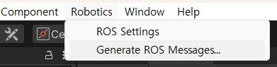

    - ROS Message Browser 창에서 ROS 메시지 경로 옆의 `Browse`를 클릭합니다.
    - 이 저장소가 클론된 ROS 디렉터리 (`Unity-Robotics-Hub/tutorials/pick_and_place/ROS/`)를 선택합니다.

        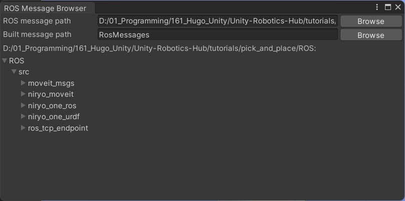

    - 그러면 이 디렉터리에 있는 모든 msg 및 srv 파일이 표시됩니다.

    > ROS 디렉터리 중 일부가 비어 있다면, `git submodule update --init --recursive`  명령을 실행하여 Git 서브모듈을 다운로드할 수 있습니다.


    - `ROS/src/moveit_msgs/msg` 아래에서 `RobotTrajectory.msg`를 찾은 후
        해당 항목의 `Build msg` 버튼을 클릭합니다.
        빌드가 완료되면 버튼 텍스트는 “Rebuild msg”로 변경됩니다.

        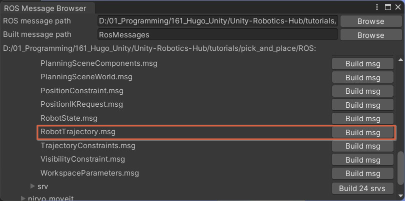 

    - `Assets/RosMessages/Moveit/msg` 디렉터리에
        `RobotTrajectoryMsg.cs`라는 새 C# 스크립트가 생성됩니다.
        이 이름은 생성한 메시지 이름에 "Msg" 접미사가 붙은 형태입니다.

4. 다음으로, 이 튜토리얼에서 사용하는 사용자 정의 메시지 스크립트를 생성합니다.
    - ROS Message Browser 창에서 `ROS/src/niryo_moveit/msg`를 확장하여 나열된 msg 파일을 확인합니다.
    - msg 옆의 `Build 2 msgs` 버튼을 클릭합니다.

        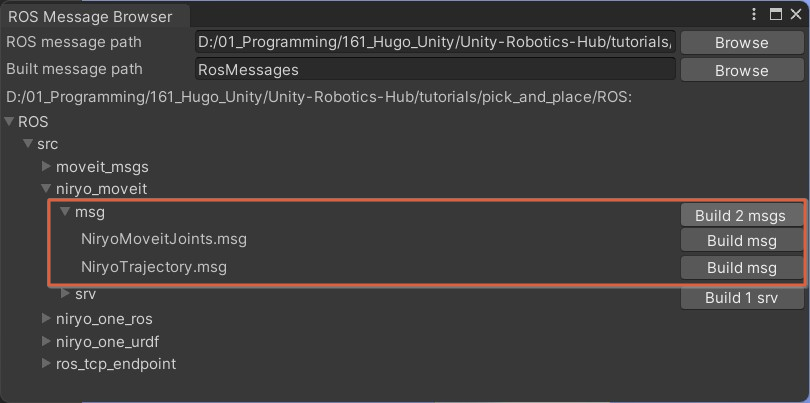

    - `Assets/RosMessages/NiryoMoveit/msg` 디렉터리에
        NiryoMoveitJointsMsg.cs와 NiryoTrajectoryMsg.cs 두 개의 C# 스크립트가 생성됩니다.
    - NiryoMoveitJoints 메시지는 Niryo 로봇 팔의 각 관절 값과 타겟 오브젝트 및 목표 위치의 포즈를 설명합니다.
    - NiryoTrajectory 메시지는 Pick-and-Place 작업을 위해 계산된 RobotTrajectory 목록을 담습니다.

5. 마지막으로, 로봇을 이동시키기 위한 서비스를 생성합니다.
    - ROS Message Browser 창에서 `ROS/src/niryo_moveit/srv`를 확장, 나열된 srv 파일을 확인합니다.
    - srv 옆의 `Build 1 srv` 버튼을 클릭합니다.

        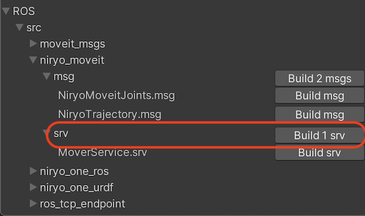

    - `Assets/RosMessages/NiryoMoveit/srv` 디렉터리에 MoverServiceRequest와 MoverServiceResponse 두 개의 C# 스크립트가 생성됩니다.
    - 이 파일들은 궤적 계산 시 사용되는 서비스 요청과 응답의 입력/출력 형식을 정의합니다.
    - 이제 ROS Message Browser 창을 닫습니다.

6. 저장소에서 `Unity-Robotics-Hub/tutorials/pick_and_place`로 이동합니다.
    - Scripts 폴더와 그 안의 내용을 선택, Unity 프로젝트의 Assets 폴더로 복사합니다.
    - 이제 프로젝트의 Assets/Scripts 안에서 두 개의 C# 스크립트를 확인할 수 있습니다.

    > SourceDestinationPublisher 스크립트는 포함된 파일 중 하나입니다.
    > 이 스크립트는 타겟과 목적지 오브젝트의 위치를 가져와
    > ROS 토픽 `"/niryo_joints"`로 전송합니다.
    > `Publish()` 함수는 다음과 같이 정의되어 있습니다.

    ```cs
    public void Publish() {
        var sourceDestinationMessage = new NiryoMoveitJointsMsg();

        for (var i = 0; i < k_NumRobotJoints; i++) {
            sourceDestinationMessage.joints[i] = m_JointArticulationBodies[i].GetPosition();
        }

        // Pick Pose
        sourceDestinationMessage.pick_pose = new PoseMsg {
            position = m_Target.transform.position.To<FLU>(),
            orientation = Quaternion.Euler(90, m_Target.transform.eulerAngles.y, 0).To<FLU>()
        };

        // Place Pose
        sourceDestinationMessage.place_pose = new PoseMsg {
            position = m_TargetPlacement.transform.position.To<FLU>(),
            orientation = m_PickOrientation.To<FLU>()
        };

        // Finally send the message to server_endpoint.py running in ROS
        m_Ros.Publish(m_TopicName, sourceDestinationMessage);
    }
    ```

    > 이 함수는 먼저 현재 관절 목표 값을 가져옵니다.
    > 그 다음 `m_Target`과 `m_TargetPlacement` 오브젝트의 포즈를 가져와
    > 새로 생성된 `sourceDestinationMessage`에 추가한 후,
    > `Send()`를 호출하여 ROS 토픽 `m_TopicName("/niryo_joints")`로 전송합니다.


    > Unity 월드 좌표계에서 ROS 월드 좌표계로의 변환이 필요합니다.
    > Unity는 x-오른쪽, y-위, z-앞(RUF) 좌표계를 사용하며,
    > ROS는 x-앞, y-왼쪽, z-위(FLU) 좌표계를 사용합니다.
    > 따라서 Unity의 `(x, y, z)`는 ROS의 `(z, -x, y)`에 해당합니다.
    > 이러한 변환은 ROS-TCP-Connector 패키지의
    > ROSGeometry 컴포넌트 에 포함된 `To<FLU>` 함수에서 수행됩니다.


7. Unity Editor로 돌아갑니다.
    - 메시지 내용이 정의되고 퍼블리셔 스크립트가 추가되었으므로, 해당 기능을 실행하기 위해 Unity 씬에 추가해야 합니다.
    - Hierarchy 창에서 우클릭하여 "Create Empty"를 선택해 새로운 빈 GameObject를 생성합니다.
    - 이름을 `Publisher`로 지정합니다.
    - Inspector에서 "Add Component"를 클릭하고
    - `SourceDestinationPublisher`를 입력하여
    - 해당 컴포넌트를 Publisher 오브젝트에 추가합니다.

        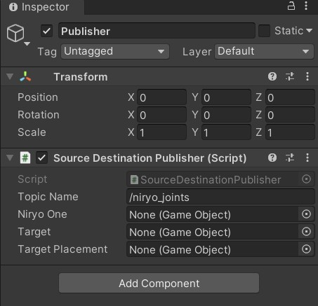

8. Inspector 창에서 이 컴포넌트의 멤버 변수들이 비어 있는 것을 확인할 수 있습니다.
    - 이 값들은 반드시 할당되어야 합니다.

        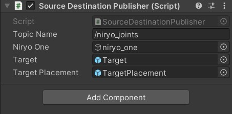

    -  Hierarchy에서 Target 오브젝트를 선택,
    - Publisher의 Target 필드에 할당합니다.
    - 동일하게 TargetPlacement 오브젝트를,
    - TargetPlacement 필드에 할당합니다.
    - niryo_one 로봇을 Niryo One 필드에 할당합니다.

9. 다음으로 ROS TCP 연결을 생성합니다.
    - 상단 메뉴에서 `Robotics -> ROS Settings`를 선택합니다.

    - ROS Settings 창에서 ROS IP Address는 Unity가 실행 중인 머신이 아닌,
    - ROS가 실행 중인 머신의 IP 주소여야 합니다.

    - Ubuntu에서 ROS 머신의 IP 주소를 확인하려면
    - 터미널을 열고 hostname -I를 입력합니다.

    - Docker 컨테이너를 사용하지 않는 경우,
    - ROS IP Address에 ROS 머신의 IP 주소를 입력하고
    - Host Port가 10000으로 설정되어 있는지 확인합니다.

    - Docker 컨테이너에서 ROS 서비스를 실행 중인 경우,
    - ROS IP Address에 루프백 주소 127.0.0.1을 입력합니다.

        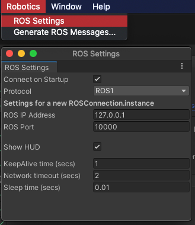

    - 나머지 설정은 기본값으로 두어도 됩니다.
    - ROS Settings를 열면 사용자가 입력한 설정으로
    - `Assets/Resources`에 `ROSConnectionPrefab`이 생성됩니다.

10. 다음으로, 사용자가 Publish() 함수를 실행할 수 있도록 UI 요소를 추가합니다.
    - Hierarchy 창에서 우클릭하여 UI > Button을 추가합니다.
    - 이 과정에서 Canvas와 Event System도 함께 생성됩니다.

    > 버튼 위치가 좌측 하단이 아니라면
    > Rect Transform 컴포넌트의 Pos X, Pos Y 값을 조정하여
    > 위치를 변경할 수 있습니다.
    > 예를 들어 Position을 (-200, -200, 0)으로 설정하면
    > 화면 우측 하단 근처로 이동합니다.

11. 새로 생성된 Button 오브젝트를 선택하고 Inspector에서 Button 컴포넌트를 찾습니다.
    - OnClick() 항목 아래의 + 버튼을 클릭하여 새 이벤트를 추가합니다.
    - Hierarchy에서 Publisher 오브젝트를 선택하여 None (Object)라고 표시된 칸에 드래그합니다.
    - No Function 드롭다운을 클릭한 뒤 SourceDestinationPublisher > Publish()를 선택합니다.

        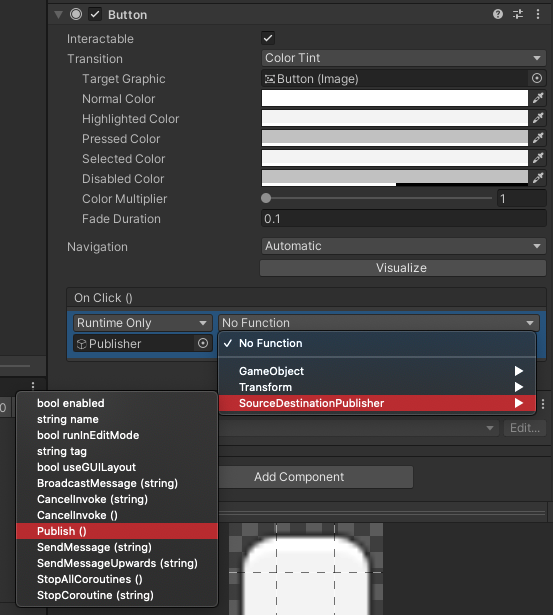

12. 버튼의 텍스트를 변경하려면
    - Button Hierarchy를 확장한 후 Text를 선택합니다.
    - 해당 컴포넌트의 Text 값을 원하는 내용으로 변경합니다.

        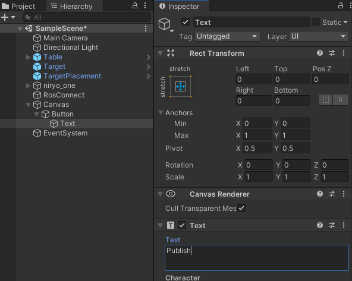

---

#### ROS 측