# Unity 기본

## Study Unity 01

- 공중에 떠있는 물체 중력 적용

### 팁

#### 01. 설정

##### 01-1. 공중 오브젝트

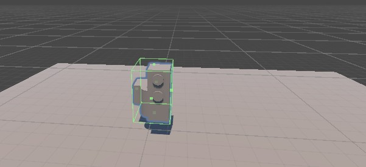

1. BoxCollider와 RigidBody

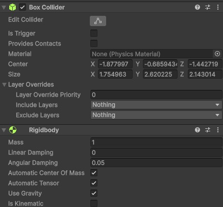

##### 01-2. 바닥 오브젝트

1. Plane일 경우 MeshCollider 만

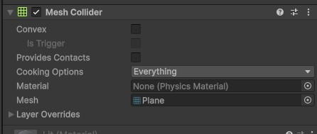

##### 01-3. 실행결과

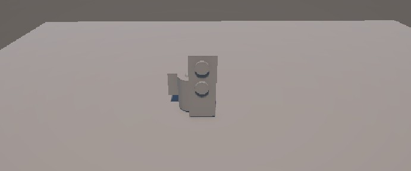

## Study Unity 03

볼 만들기

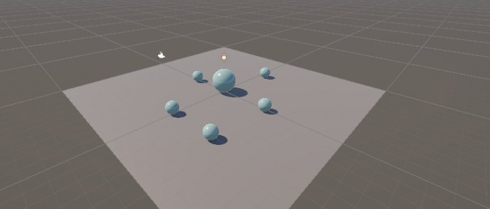

### 팁

#### 01. 머티리얼

##### 01-1. 머티리얼 생성 후 

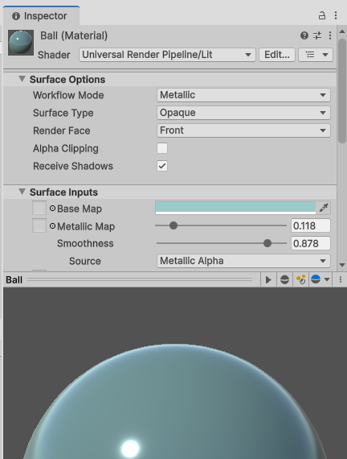


## Study Unity 04

- C# 프로그래밍 입문 교재 내용 클로닝하기

### 구현 튜토리얼

#### 01. 프로젝트 생성

##### 01-1. 첫번째 테스트

1. Unity 6.4(6000.4.9f) 로 생성
2. 화면 전환 및 UI 단축키 설명
3. Cube 객체 추가
4. Scale이 1, 1, 1 인 경우 바닥에 정확이 놓이려면
    - Position은 Y좌표 0.5가 되어야 함
5. 스크립팅 생성
    - Assets 폴더 내에 Scripting > MonoBehavior Script 생성
    - ObjectProcess 명명
    - 더블 클릭으로 VS 실행
6. iValue, sValue  등의 변수, Start()에서 초기화 Update()에서 print() 로 출력 구현
7. Cube 객체에 ObjectProcess 드래그앤드랍
8. Play 시작
9. Windows > General > Console (Ctrl + Shift + C) 로 확인

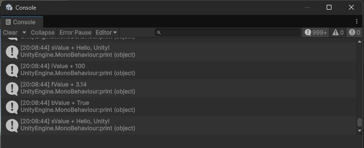

##### 01-2. 두번째 테스트

1. OnMouse 스크립트 생성
2. OnMouseEnter(), OnMouseExit(), OnMouseDown(), OnMouseUp() 코드 구현
3. 기존 ObjectProcess 스크립트는 체크해제(사용안함)
4. OnMouse 스크립트 드래그앤드랍
5. Play 시작
6. 콘솔 확인

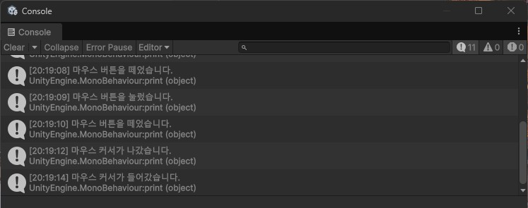

#### 01-3. 키보드 이동 처리(New)

변경된 InputSystem 쓰는 방법

1. InputSystem_Actions 더블클릭

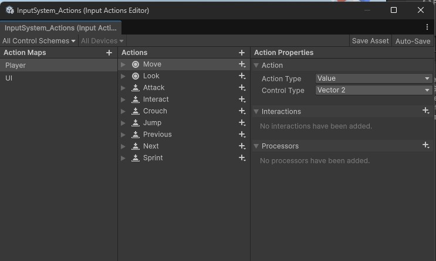

2. Action 만들기
    - Actions Maps, Player 선택
    - Actions, Move
    - Action Properties, Action > Value, Control Type > Vectors

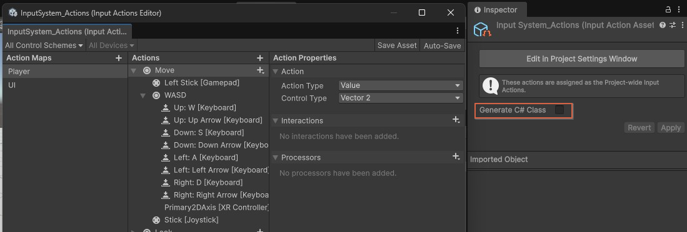

3. Generate C# Class 체크, Apply 클릭
4. InputSystem_Actions.cs 생성확인
5. CubeMover.cs 생성

    ```cs
    using UnityEngine;
    using UnityEngine.InputSystem;

    public class CubeMover : MonoBehaviour
    {
        InputSystem_Actions input;
        Vector2 move;

        public float speed = 5f;

        void Awake()
        {
            input = new InputSystem_Actions();

            input.Player.Move.performed += ctx =>
            {
                move = ctx.ReadValue<Vector2>();
            };

            input.Player.Move.canceled += ctx =>
            {
                move = Vector2.zero;
            };
        }

        void OnEnable()
        {
            input.Enable();
        }

        void OnDisable()
        {
            input.Disable();
        }

        void Update()
        {
            transform.Translate(
                new Vector3(move.x, 0, move.y)
                * speed * Time.deltaTime
            );
        }
    }
    ```

6. Cube 오브젝트에 스크립트 연결


#### 01-4. 키보드 이동 처리(Old)

- 이전 방식으로 사용할 경우

1. Edit > Project Settings > Player > Other Settings 아래
2. Active Input Handling 콤보박스, Both로 변경, Apply 클릭

    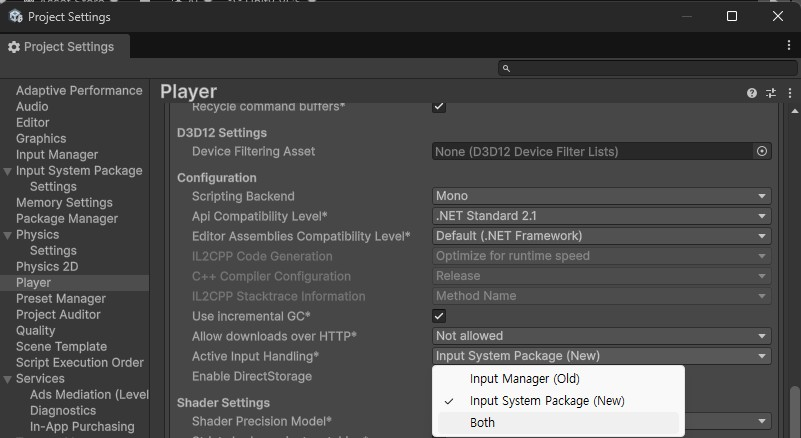

3. Unity Editor 자동 재시작

4. Cube 의 이전 CubeMover 스크립트 제거. Play로 확인
5. CubeMoveOld.cs 생성

    ```cs
    using UnityEngine;

    public class CubeMoveOld : MonoBehaviour
    {
        public float speed = 5f;

        void Update()
        {
            float h = Input.GetAxis("Horizontal");
            float v = Input.GetAxis("Vertical");

            Vector3 move = new Vector3(h, 0, v);

            transform.Translate(move * speed * Time.deltaTime);
        }
    }

    ```

### 02. 1인칭 점프게임 

#### 02-1. 프로젝트 진행

1. Project Settings > Player > Other... > Active Input Handling Both 변경
2. 재시작
3. Plane과 Capsule 배치   
4. Capsule은 Scale(1,1,1)일때 y값 1 
5. 캐릭터 컨트롤러 컴포넌트 추가
    - Capsule 오브젝트 선택 
    - Component > Physics > Character Controller 선택

    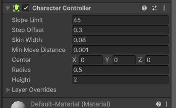

6. Assets > Create > Scripting > MonoBehaviour Script 추가
7. CharacterMove 입력
8. 코드 작성 - [소스](./Study_Unity_05/Assets/CharacterMove.cs)
9. Capsule에 적용

#### 02-2. 에셋 스토어 캐릭터

1. Asset Store > Asset Store Web 클릭
2. Character로 검색

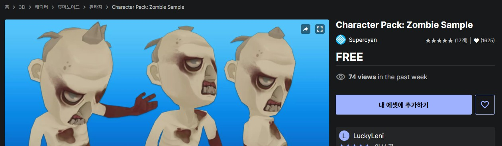

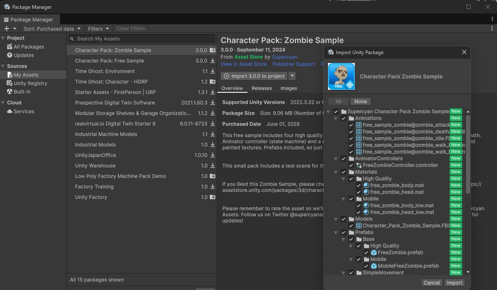

3. 프리팹 배치
4. 메인카메라 프리팹에 포함
5. 프리팹 선택 > Component > Physics > Character Controller 추가
6. CharacterMove 스크립트 추가
7. 공중에 뜸 - Collider 때문


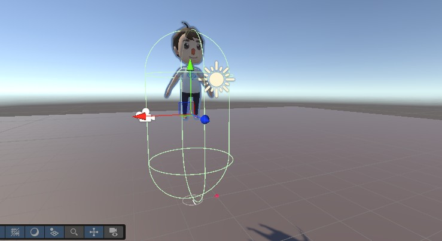

8. 프리팹 인스팩터 > Character Controller의 값 변경

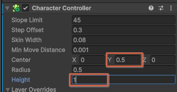

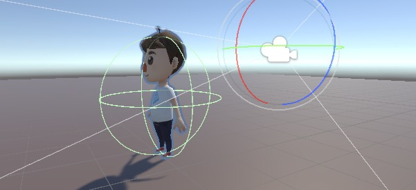

9. MainCamera 프리팹 하위로 드래그

10. 키보드 좌우를 회전으로 변경

    ```cs
    public class CharacterMove : MonoBehaviour
    {
        [SerializeField] public float speed = 10.0f;        // 이동 속도
        [SerializeField] public float rotateSpeed = 120.0f; // 회전 속도
        [SerializeField] public float jumpSpeed = 8.0f;     // 점프힘
        [SerializeField] public float gravity = 20.0f;      // 중력 값. 점프할 때 사용

        private Vector3 moveDirection = Vector3.zero;       // 실제 이동 방향 벡터

        // 매 프레임마다 실행
        void Update()
        {
            // 현재 오브젝트의 CharacterController 컴포넌트 가져오기
            CharacterController controller = GetComponent<CharacterController>();

            // 좌우 입력값 받기 (A/D, ←/→)
            float h = Input.GetAxis("Horizontal");

            // 앞뒤 입력값 받기 (W/S, ↑/↓)
            float v = Input.GetAxis("Vertical");

            // 좌우 회전 처리
            transform.Rotate(0, h * rotateSpeed * Time.deltaTime, 0);

            // 캐릭터가 바닥에 닿아있을 때만 이동 입력 처리
            if (controller.isGrounded)
            {
                // 전후 이동 방향
                moveDirection = transform.forward * v;

                // 이동 속도 적용
                moveDirection *= speed;

                // 점프 버튼(Space) 입력 시
                if (Input.GetButton("Jump"))
                    moveDirection.y = jumpSpeed;
            }

            // 중력 적용
            // Time.deltaTime
            // 컴퓨터 성능마다 속도가 달라지는 걸 막기 위해서 사용
            moveDirection.y -= gravity * Time.deltaTime;

            // 실제 이동 처리
            controller.Move(moveDirection * Time.deltaTime);
        }
    }    
    ```

### 03. 충돌과 음향효과

#### 03-1. 작은 큐브에 중력 추가

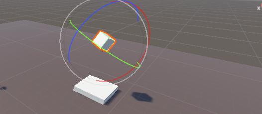

- 작은 큐브에 RigidBody 추가

#### 03-2. 충돌시 로그출력 스크립트 추가

```cs
private void OnCollisionEnter(Collision collision)
{
    print("충돌발생!");
}
```

- 작은 큐브에 스크립트 적용

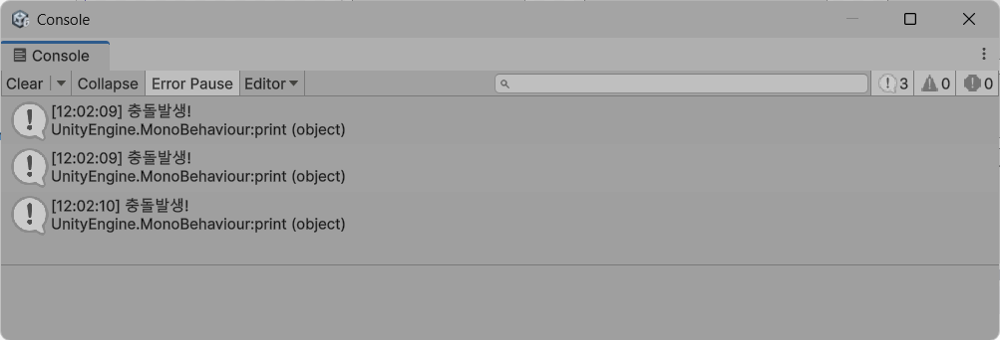

#### 03-3. 음향효과

- 사운드 구글링으로 다운로드
- Assets > Import New Asset 클릭
- Audio Source 또는 큐브로 드래그앤드랍
- Play On Awake 체크박스 해제

```cs
public class ObjectCollision : MonoBehaviour
{
    public AudioSource collsionSound;

    // Start is called once before the first execution of Update after the MonoBehaviour is created
    void Start()
    {
        collsionSound = GetComponent<AudioSource>();    
    }

    private void OnCollisionEnter(Collision collision)
    {
        collsionSound.Play();
        print("충돌발생!");
    }
}
```

#### 03-4. 캐릭터 애니메이션 적용

- 캐릭터 프리팹 Inspector내에 Animator 확인

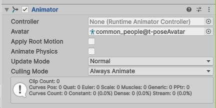

- 기존 생성된 애니메이터가 있는 경우 바로 선택가능

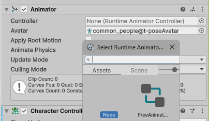

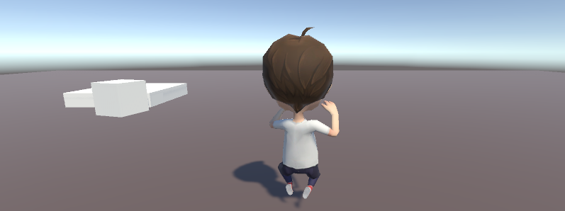

- 새 애니메이터 컨트롤러 생성

- Create > Animation > Animator Controller 생성
- 이름 지정후 더블클릭

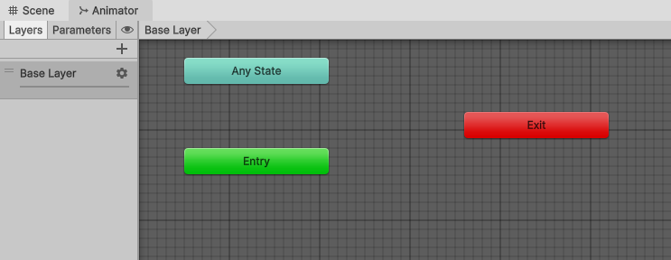

- 애니메이터 뷰에서 상태와 상태 전이 추가
    - Idle 드래그 추가
    - Walk 추가
    - Idle에서 마우스오른쪽 Make Transition 클릭
    - Walk 클릭

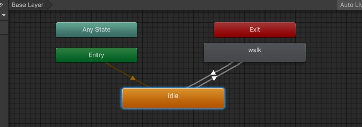

- Parameters 탭 + 클릭
- float 선택 `Speed` 입력
- Idle -> Walk Transion 클릭 후 Inspector
- `Has Exit Time` 체크 해제 - 애니메이션이 모두 끝날때가지 대기함(**중요!**)
- Contitions List is Empty 오른쪽 아래 + 클릭

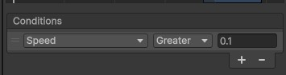

- Walk -> Idle 은 반대 컨디션 적용

- 기존 캐릭터 동작 스크립트에 애니메이터 적용


#### 99. UserInterface


