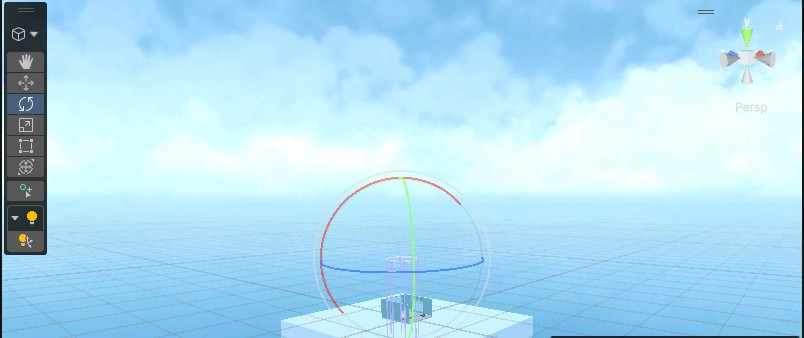
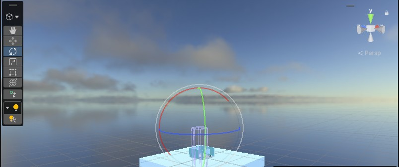
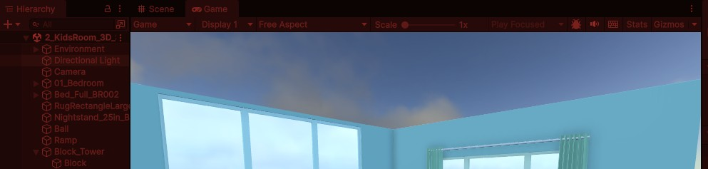
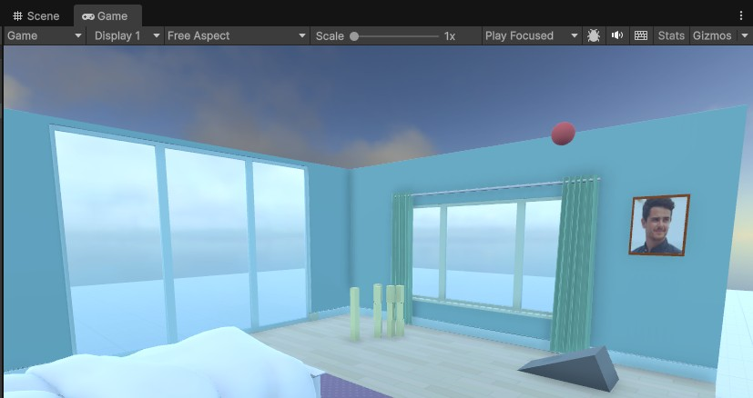
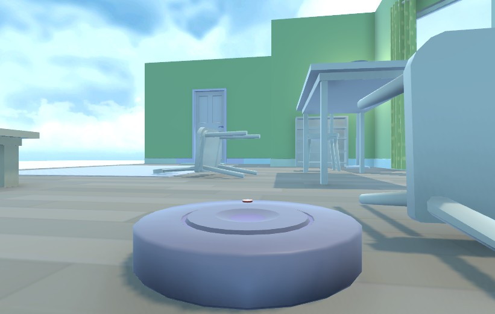
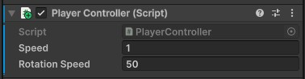

# Practice

## Essentials Pathway Clonning


### 01. 프로젝트 생성

- 템플릿 다운로드 후 프로젝트 생성

### 02. 튜토리얼 학습


- 오른쪽 Inspector 위치의 `Tutorials` 순서대로 클릭
- 1. Editor Essentials 클릭


- 다음 메뉴 표시, 클릭

- 튜토리얼에 지시하는 대로 진행


- Tutorial 1의 2 - Master 3D scene navigation 진행중
- 5 / 12 스텝에서 키보드 단축키 확인 가능


#### Unity shortcuts reference

Scene 뷰 이동:
- View(시점 보기): 마우스 오른쪽 버튼을 누른 채 드래그. 오른쪽 버튼을 누른 상태에서 `WASD` 키로 이동. `Q/E` 키로 아래/위 이동 가능
- Frame(오브젝트에 화면 맞추기): Scene 뷰에서 `F` 키
- Orbit (회전):  `Alt` (macOS: `Option`키) 누른 상태에서 마우스 왼쪽 버튼 드래그
- Zoom (확대/축소): 마우스 휠 스크롤, `Alt`(macOS는 `Option`) + 마우스 오른쪽 버튼 드래그
- Flythrough Mode (비행 이동 모드): 마우스 오른쪽 버튼 누른 상태에서 `WASD` 키로 이동. `Q/E` 키로 아래/위 이동 가능

Scene view tools shortcuts:
- View: Q
- Move: W
- Rotate: E
- Scale: R
- Rect: T
- Transform: Y

기타 단축키:
- Undo: Ctrl+Z (macOS: Cmd+Z)
- Save: Ctrl+S (macOS: Cmd+S)


#### Collider 팁

- 2, 3D Essentials 진행 중
- Ball의 속성
    - Sphere Collider의 Ball_Pysics 적용 
    - RigidBody 
    - Ball Material 확인


- Ramp 속성
    - Mesh Collider의 Convex 적용


- Ramp 바운딩 확인

#### Adjust lights...


- 카메라 시점 이동
    - 시점 변경 후 Ctrl+Shift+F 클릭해서 보이는 대로 카메라 시점 변환!

- 라이트 조정
    - Directional Light 선택
    - 비추는 방향 Rotate Tool로 조정
    - Color와 Intensity 조정

- 스카이박스 조정 - 단순 드래그로 변경 가능
    
    

- 플레이모드 색상 변경 - 플레이모드와 일반 편집모드 구분용
    - Edit > Preferences... 
    - Colors > General > Playmode tint 변경(보통 붉은계열)

    

- 오브젝트 v 키 - 물체 기준점 변경, 쉽게 오브젝트 쌓기 가능

- 액자만들기
    - Quad와 Material로 작업
    - 기존 Quad 복사 후 Photo와 그룹핑



#### Programming

- 4_LivingRoom_Programming_Scene 로딩
- Prefab > Characters에서 RobotVacuum 드래그 
    - 사이즈를 0.4로 변경
- Player로 이름변경
- 스크립트 생성 

    ```cs
    using UnityEngine;
    using UnityEngine.InputSystem;

    /// <summary>
    /// WASD 또는 방향키를 사용하여
    /// 전진/후진 및 좌우 회전을 처리하는 플레이어 컨트롤러
    /// </summary>
    public class PlayerController : MonoBehaviour
    {
        [Tooltip("전진/후진 이동 속도 (초당 이동 거리)")]
        public float speed = 5.0f;

        [Tooltip("회전 속도 (초당 회전 각도)")]
        public float rotationSpeed = 120.0f;

        // Rigidbody 컴포넌트 참조
        private Rigidbody rb;

        private void Start()
        {
            // 현재 게임오브젝트의 Rigidbody 가져오기
            rb = GetComponent<Rigidbody>();

            // Rigidbody가 없으면 경고 출력
            if (rb == null)
                System.Diagnostics.Debug.WriteLine("PlayerController에는 Rigidbody가 필요합니다.");
        }

        private void FixedUpdate()
        {
            // 입력값 저장용 변수
            // x : 좌우 회전
            // y : 전진/후진
            Vector2 moveInput = Vector2.zero;

            // -----------------------------
            // 전진 입력 (W 또는 ↑)
            // -----------------------------
            if (Keyboard.current.wKey.isPressed ||
                Keyboard.current.upArrowKey.isPressed)
            {
                moveInput.y = 1f;
            }

            // -----------------------------
            // 후진 입력 (S 또는 ↓)
            // -----------------------------
            if (Keyboard.current.sKey.isPressed ||
                Keyboard.current.downArrowKey.isPressed)
            {
                moveInput.y = -1f;
            }

            // -----------------------------
            // 좌회전 입력 (A 또는 ←)
            // -----------------------------
            if (Keyboard.current.aKey.isPressed ||
                Keyboard.current.leftArrowKey.isPressed)
            {
                moveInput.x = -1f;
            }

            // -----------------------------
            // 우회전 입력 (D 또는 →)
            // -----------------------------
            if (Keyboard.current.dKey.isPressed ||
                Keyboard.current.rightArrowKey.isPressed)
            {
                moveInput.x = 1f;
            }

            // ==================================================
            // 이동 처리
            // ==================================================
            // 현재 바라보는 방향(transform.forward)으로
            // 전진 또는 후진 이동
            Vector3 movement =
                transform.forward *
                moveInput.y *
                speed *
                Time.fixedDeltaTime;

            // Rigidbody를 이용하여 위치 이동
            rb.MovePosition(rb.position + movement);

            // ==================================================
            // 회전 처리
            // ==================================================

            // 기본 회전 방향
            float turnDirection = moveInput.x;

            // 후진 중에는 자동차처럼 회전 방향을 반대로 변경
            if (moveInput.y < 0)
                turnDirection = -turnDirection;

            // 이번 프레임에 회전할 각도 계산
            float turn =
                turnDirection *
                rotationSpeed *
                Time.fixedDeltaTime;

            // Y축 기준 회전값 생성
            Quaternion turnRotation =
                Quaternion.Euler(0f, turn, 0f);

            // Rigidbody 회전 적용
            rb.MoveRotation(rb.rotation * turnRotation);
        }
    }
    ```
- 일반 속도(1)와 회전 속도(50) 조절



- 플레이중에 변경 가능

    

- 플레이어가 수집할 코인 만들기
    - Scene 뷰 상단에서 좌표계를 Global 대신 Local로 변경
    - 아이템이 회전할 때 방향이 어떻게 변하는지 확인가능

- 코인 스크립트 Update() 에 추가
    ```cs
    public class Collactible : MonoBehaviour
    {
        public float rotateSpeed = 0.7f;

        // Update is called once per frame
        void Update()
        {
            transform.Rotate(0, rotateSpeed, 0);
        }
    }
    ```

https://github.com/user-attachments/assets/031fed25-9a71-48db-8800-2ecf6e1bdd62

- 
