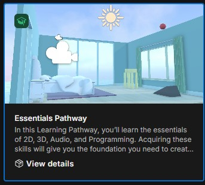
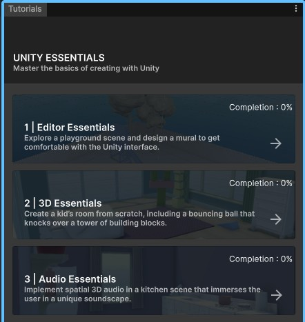
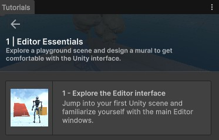
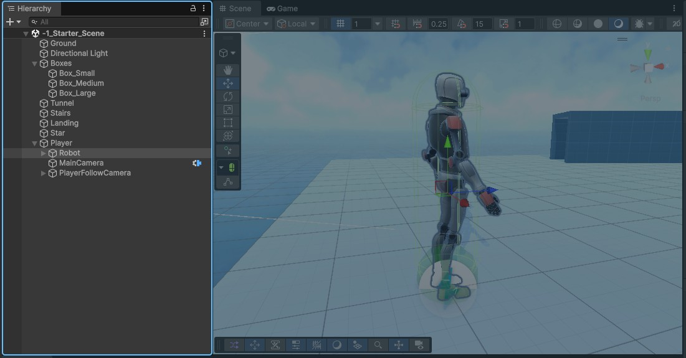
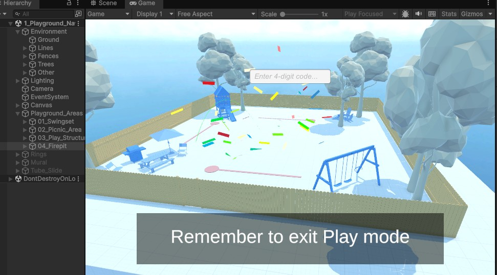
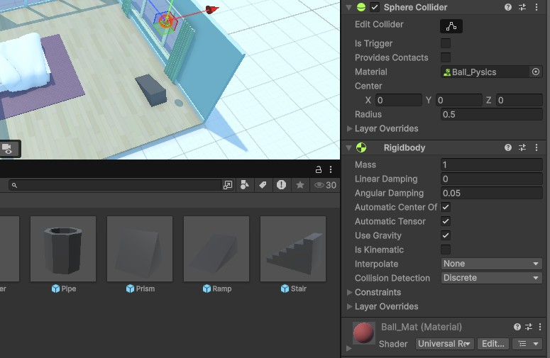
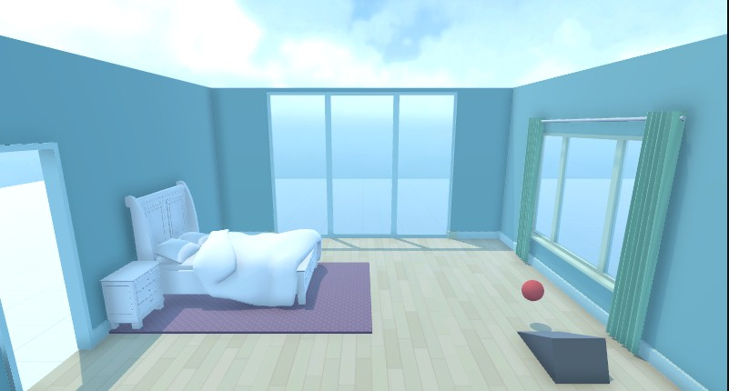
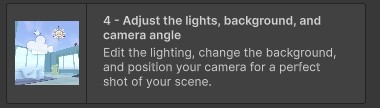

# Practice

## Essentials Pathway Clonning

### 01. 프로젝트 생성

- 템플릿 다운로드 후 프로젝트 생성

### 02. 튜토리얼 학습

- 오른쪽 Inspector 위치의 `Tutorials` 순서대로 클릭
- 1. Editor Essentials 클릭

- 다음 메뉴 표시, 클릭

- 튜토리얼에 지시하는 대로 진행

- Tutorial 1의 2 - Master 3D scene navigation 진행중
- 5 / 12 스텝에서 키보드 단축키 확인 가능

#### Unity shortcuts reference

Scene 뷰 이동:
- View(시점 보기): 마우스 오른쪽 버튼을 누른 채 드래그. 오른쪽 버튼을 누른 상태에서 `WASD` 키로 이동. `Q/E` 키로 아래/위 이동 가능
- Frame(오브젝트에 화면 맞추기): Scene 뷰에서 `F` 키
- Orbit (회전):  `Alt` (macOS: `Option`키) 누른 상태에서 마우스 왼쪽 버튼 드래그
- Zoom (확대/축소): 마우스 휠 스크롤, `Alt`(macOS는 `Option`) + 마우스 오른쪽 버튼 드래그
- Flythrough Mode (비행 이동 모드): 마우스 오른쪽 버튼 누른 상태에서 `WASD` 키로 이동. `Q/E` 키로 아래/위 이동 가능

Scene view tools shortcuts:
- View: Q
- Move: W
- Rotate: E
- Scale: R
- Rect: T
- Transform: Y

기타 단축키:
- Undo: Ctrl+Z (macOS: Cmd+Z)
- Save: Ctrl+S (macOS: Cmd+S)

#### Collider 팁

- 2, 3D Essentials 진행 중
- Ball의 속성
    - Sphere Collider의 Ball_Pysics 적용 
    - RigidBody 
    - Ball Material 확인

- Ramp 속성
    - Mesh Collider의 Convex 적용

- Ramp 바운딩 확인

#### To be continued...

- 여기서 부터