# Unity Factory 실습

## Industry Fundamentals Learn

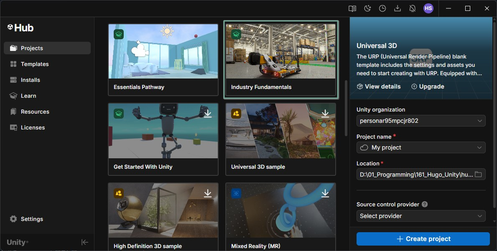

Unity 공식 설명상 이 템플릿은 `Unity Industry 구독자` 또는 `30일 무료 체험 사용자`가 Unity Hub에서 받을 수 있고, CAD → 최적화 → 자동화 → 실시간 산업용 시뮬레이션 대시보드 흐름을 배우는 4개 튜토리얼 구조

## Conveyor Belt 모델 가져오기

### Part 1. 3D모델 웹사이트 1

- https://www.cgtrader.com/search?free=1&keywords=conveyor+belt&suggested=1 에서 Conveyor Belt 검색 및 Free 클릭

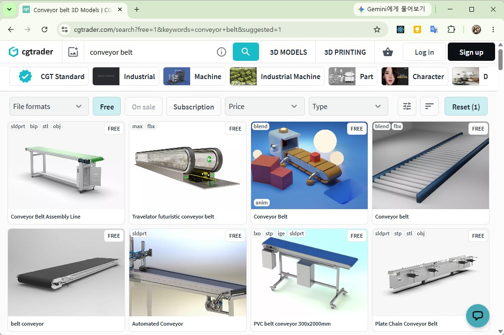

- 회원가입 후 다운로드 클릭(시간 소요)

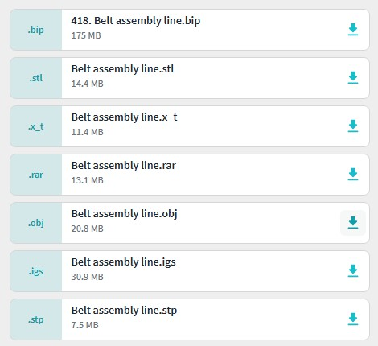

- OBJ 클릭
- 다운로드 한 obj 파일을 Unity Project에 드래그

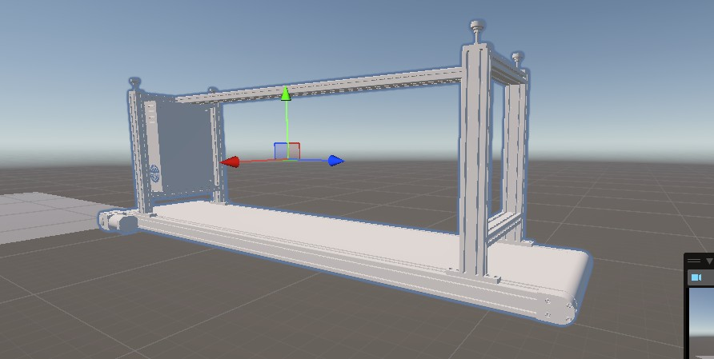

- 뒤집혀 나오는 이유?

### Part 2. 3D모델 웹사이트 2

- https://poly.pizza/ 에서 Conveyor Belt 검색

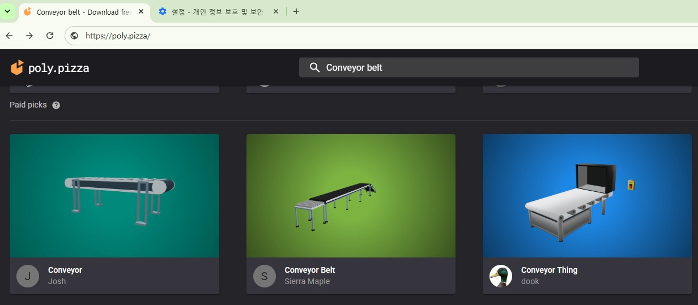

- Obj 파일 다운로드

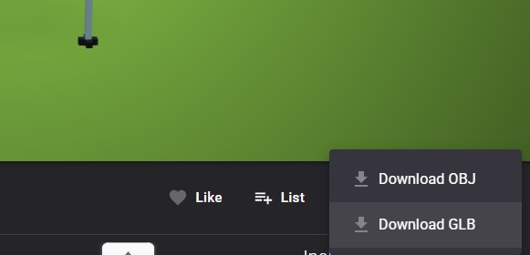

- 압축해제 후 Project 창에 드래그 
   - materials.mtl
   - model.obj 

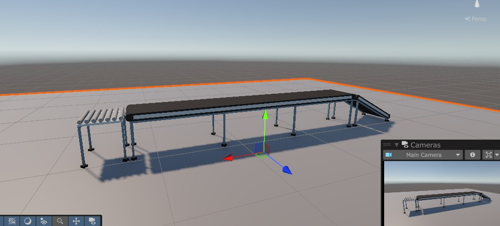

### Part 3. SketchFab

- https://sketchfab.com/
- EpicGames 계정으로 로그인 가능

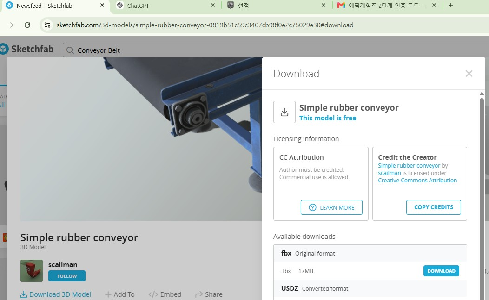

- FBX 다운로드 가능

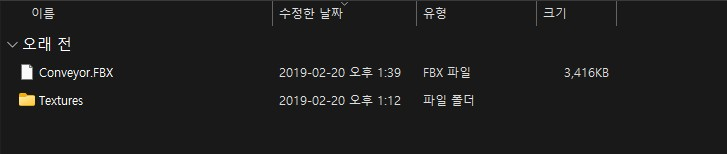

- Conveyor.FBX를 Project 창 Models 폴더에 드래그

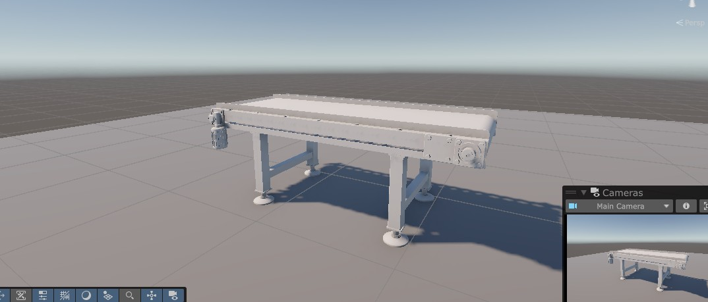

- Textures에 포함된 다섯개 png를 Textures 폴더에 드래그

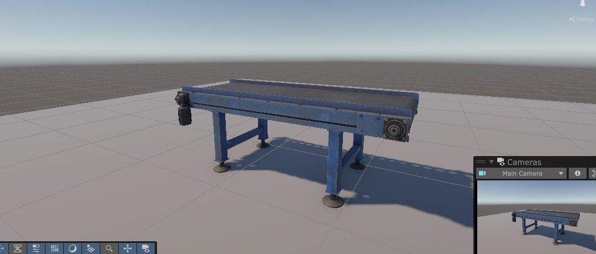

## Unity Factory 에셋 가져오기

### Part 1. Unity Factory 에셋 소개

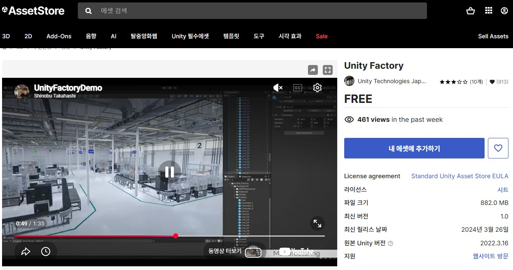

Unity Technologies Japan에서 공개한 무료 공장 환경 에셋입니다.

특징은 다음과 같습니다.

* 무료
* HDRP 지원
* 실제 제조공장 분위기 제공
* 생산라인 예제 포함
* 산업용 로봇 포함
* 디지털트윈 실습에 적합

### 핵심정보


| 항목            | 내용                            |
| ----------------- | --------------------------------- |
| 이름            | **Unity Factory**               |
| 퍼블리셔        | **UJ Unity Technologies Japan** |
| 가격            | **무료**                        |
| 파일 크기       | **882 MB**                      |
| 최신 버전       | **1.0**                         |
| 출시일          | **2024년 3월 25일**             |
| 원본 Unity 버전 | **2022.3.16**                   |
| 렌더 파이프라인 | **HDRP만 호환**                 |
| Built-in / URP  | 호환 안 됨                      |

### Part 2. HDRP 프로젝트 생성

#### 새 프로젝트 만들기

Unity Hub 실행

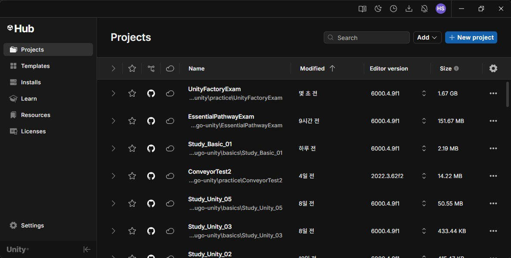

새 프로젝트 클릭

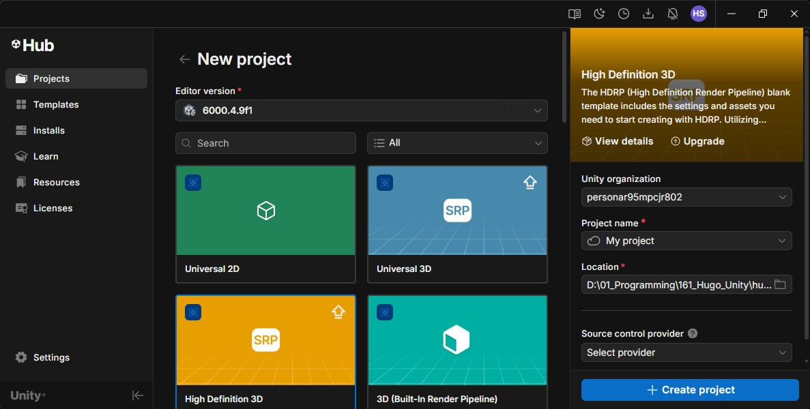

High Definition 3D 선택 후 진행

---

### Part 3. Unity Factory Import

#### Asset Store 추가

가장 간단한 방법,

https://assetstore.unity.com/packages/3d/environments/industrial/unity-factory-276400 웹사이트에서 **내 애셋에 추가** 버튼 클릭 후 **Unity에서 열기** 로 진행

#### HDRP Wizard 확인

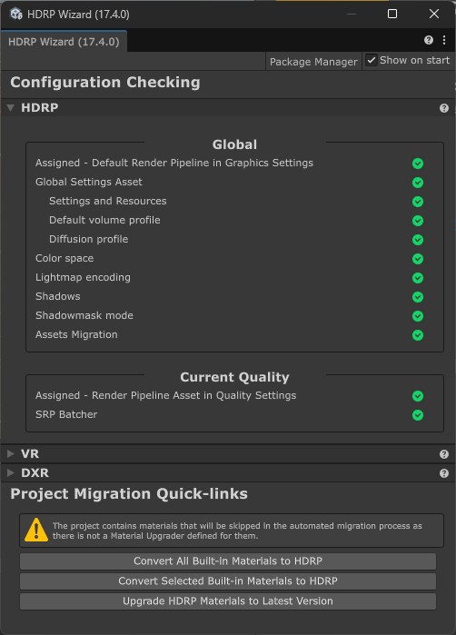

- Convert All Built-In Materials to HDRP 확인 필요

#### Import

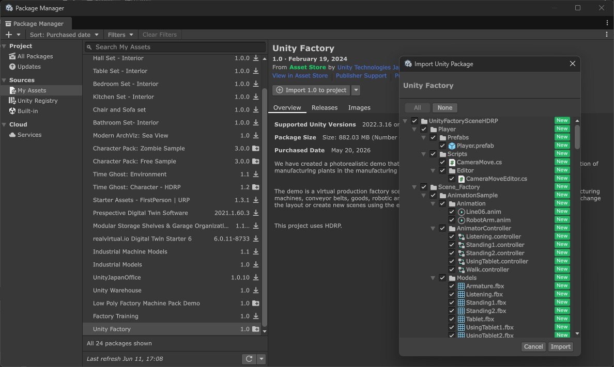

#### Project 창

1. UnityFactorySceneHDRP > Scene_Factory 클릭
2. FactorySceneSample 클릭
3. Unity Editor 재시작
4. Spline 오류 해결
   1. Package Manager > Unity Register 에서 `Splines` 검색 후 설치
5. Project Settings
   1. Player > Other Settings > Active Input Handling 을 Both 로 선택, 재시작
6. Hierarchy 창
   1. Global Volume 선택 Inspector > Global Volume 이름 앞 체크박스 해제
   2. Player와 RobotArm White Glow 해결


### Part 4. 공장 씬 둘러보기

#### Play

- WSAD 키와 마우스 오른쪽 버튼으로 이동


#### 주요 구성 요소

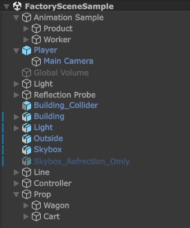

Hierarchy에서 확인

```
Factory
```

생산라인

```
Conveyor
```

컨베이어

```
Arm
```

산업용 로봇

```
Machine
```

제조 장비

```
Worker
```

작업자

#### 공장 구조 분석

생산라인 흐름

```
입고
 ↓
컨베이어
 ↓
가공장비
 ↓
검사장비
 ↓
출고
```

---

## Unity Factory 기반 스마트팩토리 디지털트윈 튜토리얼

### 프로젝트 목표

최종적으로 아래와 같은 시스템을 만듭니다.

```

┌─────────────────────┐
│ Raspberry Pi Sensor                      │
└──────────┬──────────┘
           │ MQTT
           ▼
┌─────────────────────┐
│ MQTT Broker                              │
└──────────┬──────────┘
           │
           ▼
┌─────────────────────┐
│ Unity Factory                            │
├─────────────────────┤
│ Conveyor Belt                            │
│ Product Box                              │
│ Robot Arm                                │
│ Dashboard                                │
└─────────────────────┘
```

### Part 1. 새 디지털트윈 씬 만들기

#### 기존 씬 복사

현재 샘플 씬은 건드리지 않습니다.

FactorySceneSample 씬 복사


#### 불필요한 오브젝트 제거

남길 것

```
Building
Light
Skybox
Reflection Probe
Global Volume
```

제거

```
Animation Sample
Worker
Product
Controller
```

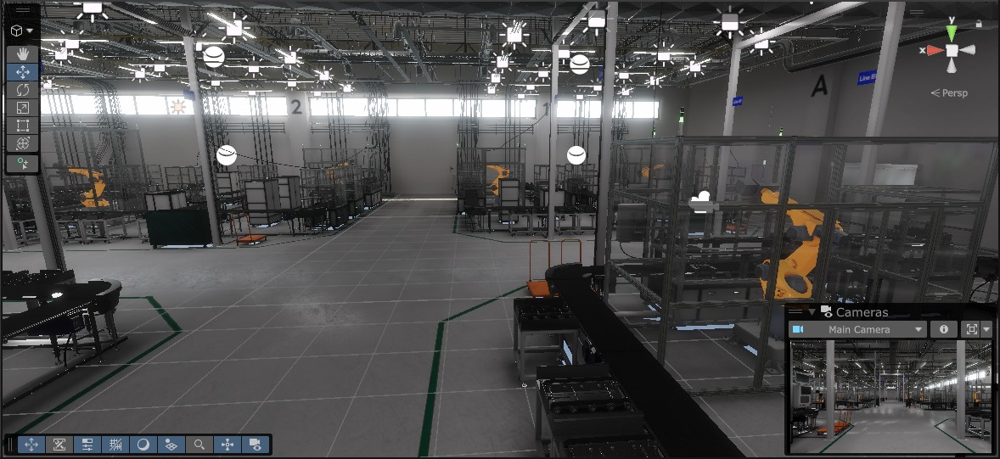

-  Scene에 Worker등의 오브젝트 제거됨

- Hierarchy 창에서 아래에서 부터 그룹의 맨 마지막 오브젝트부터 삭제하면서 전체구조 파악

#### Light 오브젝트

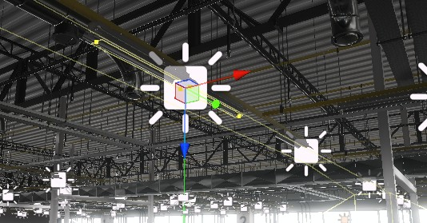

- 선택 후 인스펙터 확인

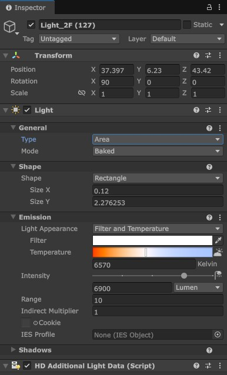

- 생산라인 1번 이외의 Light 도 삭제 처리

#### Reflection Probe

- 유리 반사판

#### Player 에 할당된 컴포넌트

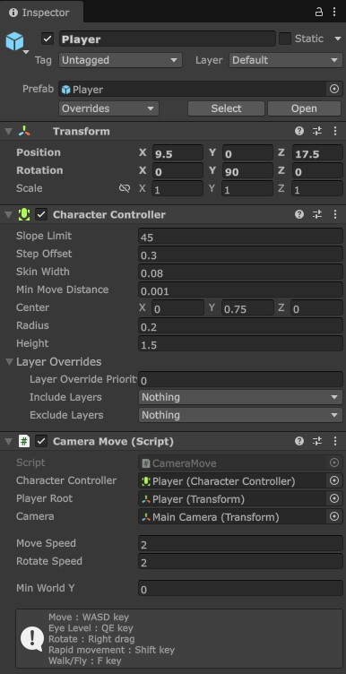

- Character Controller
   - 플레이어 캐릭터를 움직이기 위한 전용 컴포넌트
   - 플레이어를 Rigidbody로 움직이면
      - 벽에 부딪히면 튕김
      - 계단 오르기 어려움
      - 중력 처리 복잡

- Character Controller의 주요 속성
   - Slope Limit : 45 - 45도 경사까지 올라갈 수 있음
   - Step Offset : 0.3 - 계단을 자동으로 올라갈 수 있는 높이 0.3m
   - Skin Width : 0.08 - 충돌 여유공간
   - Min Move Distance : 0.001 - 해당 거리 이하 이동은 무시
   - Center : 캡슐 충돌체 중심
   - Radius : 0.2 - 캐릭터 폭

- CameraMove 스크립트

```cs
namespace UnityFactorySceneHDRP
{
    public class CameraMove : MonoBehaviour
    {
        // 플레이어 충돌과 이동을 담당하는 CharacterController
        [SerializeField] private CharacterController _characterController;

        // 플레이어 전체의 기준 Transform
        // 좌우 회전(Yaw)은 이 오브젝트가 담당
        [SerializeField] private Transform _playerRoot;

        // 실제 카메라 Transform
        // 위아래 회전(Tilt)은 카메라가 담당
        [SerializeField] private Transform _camera;

        [Space(10)]

        // 기본 이동 속도
        [SerializeField] private float _moveSpeed = 2;

        // 마우스 회전 속도
        [SerializeField] private float _rotateSpeed = 2;

        [Space(10)]

        // 플레이어가 내려갈 수 있는 최소 Y 위치
        // 바닥 아래로 떨어지는 것을 방지
        [SerializeField] private float _minWorldY;

        // 좌우 회전값
        private float _yaw = 0;

        // 위아래 카메라 회전값
        private float _tilt = 0;

        // 빠른 이동 모드 여부
        private bool _isRunning = false;

        // 걷기 모드 여부
        // true  = 걷기 모드
        // false = 비행 모드
        private bool _isWalkMode = true;

        private void Awake()
        {
            // 현재 플레이어의 Y 회전값을 저장
            _yaw = _playerRoot.eulerAngles.y;

            // 현재 카메라의 X 회전값을 저장
            _tilt = _camera.localEulerAngles.x;
        }

        private void Update()
        {
            // =========================
            // 1. 마우스 우클릭 회전
            // =========================

            // 마우스 오른쪽 버튼을 누르고 있을 때만 시점 회전
            if (Input.GetMouseButton(1))
            {
                // 마우스 좌우 이동값으로 플레이어를 좌우 회전
                _yaw += Input.GetAxis("Mouse X") * _rotateSpeed;

                // 마우스 위아래 이동값으로 카메라를 상하 회전
                // 마우스를 위로 올리면 화면이 위를 보도록 - 처리
                _tilt -= Input.GetAxis("Mouse Y") * _rotateSpeed;

                // 너무 위/아래로 돌아가서 뒤집히지 않도록 제한
                _tilt = Mathf.Clamp(_tilt, -89, 89);

                // 플레이어 전체는 Y축만 회전
                _playerRoot.eulerAngles = new Vector3(0, _yaw, 0);

                // 카메라는 X축만 회전
                _camera.localEulerAngles = new Vector3(_tilt, 0, 0);
            }

            // =========================
            // 2. 이동 입력 받기
            // =========================

            // Horizontal = A/D 또는 ←/→
            // Vertical   = W/S 또는 ↑/↓
            Vector3 dir = new Vector3(
                Input.GetAxis("Horizontal"),
                0,
                Input.GetAxis("Vertical")
            );

            // Q/E 키로 카메라 높이 조절
            // Q = 아래
            // E = 위
            // Mathf.Max(0, ...)는 카메라 높이가 0 아래로 내려가지 않게 함
            float height = Mathf.Max(
                0,
                _camera.localPosition.y +
                (
                    (Input.GetKey(KeyCode.Q) ? -_moveSpeed : 0) +
                    (Input.GetKey(KeyCode.E) ? _moveSpeed : 0)
                ) * Time.deltaTime
            );

            // =========================
            // 3. 빠른 이동 모드 전환
            // =========================

            // Shift를 한 번 누를 때마다 빠른 이동 ON/OFF
            // 누르고 있는 동안만 빠른 이동이 아니라 토글 방식
            if (Input.GetKeyDown(KeyCode.LeftShift) ||
                Input.GetKeyDown(KeyCode.RightShift))
            {
                _isRunning = !_isRunning;
            }

            // =========================
            // 4. 걷기 모드 이동
            // =========================

            if (_isWalkMode)
            {
                // 입력 방향을 플레이어가 바라보는 방향 기준으로 변환
                // 예: 플레이어가 오른쪽을 보고 있으면 W는 오른쪽 방향 이동
                dir = Quaternion.Euler(
                    0,
                    _playerRoot.localEulerAngles.y,
                    0
                ) * dir;

                // CharacterController의 SimpleMove 사용
                // SimpleMove는 내부적으로 Time.deltaTime과 중력을 처리함
                _characterController.SimpleMove(
                    dir * _moveSpeed * (_isRunning ? 3 : 1)
                );

                // 걷기 모드에서는 Q/E로 카메라 눈높이만 변경
                _camera.localPosition = new Vector3(0, height, 0);
            }
            else
            {
                // =========================
                // 5. 비행 모드 이동
                // =========================

                // 카메라가 바라보는 방향까지 포함해서 이동 방향 계산
                // 위를 보고 W를 누르면 위쪽으로 날아감
                dir = Quaternion.Euler(
                    _camera.localEulerAngles.x,
                    _playerRoot.localEulerAngles.y,
                    _camera.localEulerAngles.z
                ) * dir;

                // CharacterController.Move 사용
                // Move는 Time.deltaTime을 직접 곱해줘야 함
                _characterController.Move(
                    dir * _moveSpeed * (_isRunning ? 3 : 1) * Time.deltaTime
                );
            }

            // =========================
            // 6. 바닥 아래로 떨어지는 것 방지
            // =========================

            // 플레이어 위치가 최소 Y값보다 낮아지면
            // 강제로 최소 Y값으로 올림
            if (_playerRoot.position.y < _minWorldY)
            {
                Vector3 position = _playerRoot.position;
                position.y = _minWorldY;
                _playerRoot.position = position;
            }

            // =========================
            // 7. 걷기 / 비행 모드 전환
            // =========================

            // F 키를 누르면 걷기 모드와 비행 모드 전환
            if (Input.GetKeyDown(KeyCode.F))
            {
                _isWalkMode = !_isWalkMode;

                if (_isWalkMode)
                {
                    // 비행 모드 → 걷기 모드

                    // 플레이어 위치를 바닥 높이로 내림
                    _playerRoot.position = new Vector3(
                        _playerRoot.position.x,
                        _minWorldY,
                        _playerRoot.position.z
                    );

                    // 카메라는 사람 눈높이 정도로 올림
                    _camera.localPosition = new Vector3(0, 1.5f, 0);
                }
                else
                {
                    // 걷기 모드 → 비행 모드

                    // 현재 카메라의 월드 Y 위치를 플레이어 위치로 사용
                    _playerRoot.position = new Vector3(
                        _playerRoot.position.x,
                        _camera.position.y,
                        _playerRoot.position.z
                    );

                    // 카메라는 Player Root 위치와 일치시킴
                    _camera.localPosition = Vector3.zero;
                }
            }
        }
    }
}
```

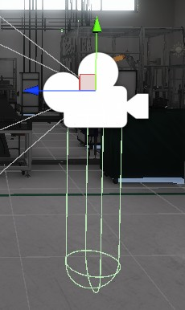

### Part 2. 생산라인 설계

#### 공정 구조

우리가 만들 공정

```
투입
 ↓
컨베이어
 ↓
센서
 ↓
로봇암
 ↓
출고
```

계속