## Unity Learn

### Unity 핵심 기초

- [Unity Tutorial](https://learn.unity.com/tutorial/unity-editeo-ihae?uv=2020.3&courseId=614c0b2fedbc2a47200dce44&projectId=614bdef2edbc2a3d83d75f48#)
    - 내 Tutorial1&2_GettingStarted.zip 사용

    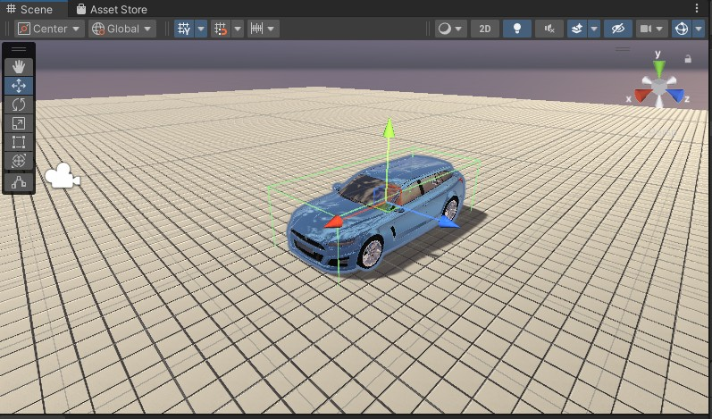

    - 이동 : 마우스 오른쪽 버튼 + WSAD
    - 회전 : 마우스 오른쪽 버튼

- UnityStudy01 : 오브젝트 선택 

    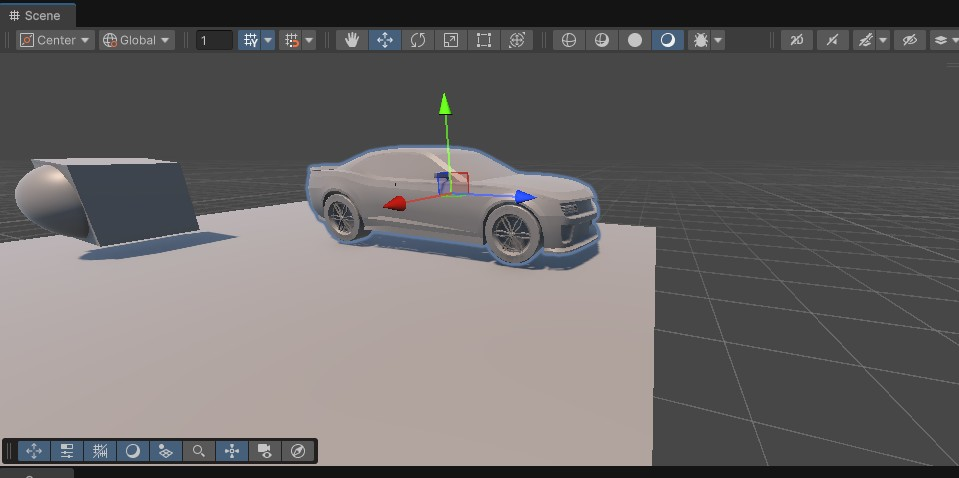

- 카메라 프로젝션
    1. Perspective
    2. Orthographic

#### 물리엔진

- Collider : 콜라이더 

    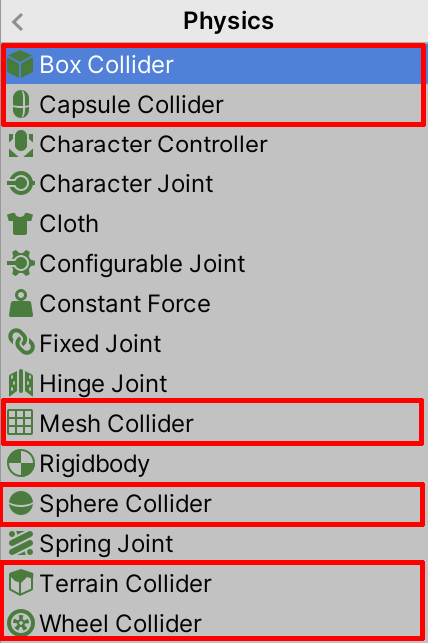

- Trigger : 트리거
    - 오브젝트가 트리거 영역에 들어가거나 나올 때 이벤트 호출

- RigidBody : 리지드바디
    - 중력 프로퍼티

- Collision Detection : 출동 탐지
    - 스크립트

    ```cs
    // 충돌이 인식되면
    void OnCollisionEnter(Collision collision) {
        if (collision.gameObject.CompareTag("Enemy")) {
            // Hit the enemy
        }
    }

    // 충돌 중에 호출
    void OnCollisionStay(Collision collision) {
        // ...
    }

    // 충돌이 정지하면 호출
    void OnCollisionExit(Collision collision) {
        // ...
    }

    // 중력 활성화/비활성화
    bool rigidBody.useGravity;

    // 특정방향으로 힘 추가
    *rigidBody.AddForce(Vector3);

    // 축 주위 회전력 추가
    rigidbody.AddTorque(Vector3, Force Mode)
    ```

- Force Mode : 힘 모드
    - Acceleration : 일정한 비율로 증가하는 힘 적용
    - Force : 기본 설정, 질량을 고려하여 힘이 점진적으로 적용
    - Impulse : 순간적인 힘 적용
    - VelocityChange : 다양한 방향으로 순간적인 힘 적용. 질량을 무시됨

- Update 함수
    - Update : 프레임당 한 번 호출
    - FixedUpdate : 프레임당 여러번 호출. 물리 계산 등 

- 물리 머티리얼 : 표면 마찰 등 다른 표면과 상호작용 방식 제어

- 물리 조인트 : 리지드 바디를 또 다른 리지드 바디나 공간 내 정해진 지점에 연결. 관절등의 기능 구현에 사용

- 래이 캐스팅 : 물리 오브젝트와 다른 오브젝트 간의 광선 또는 보이지 않는 연결을 캐스트

#### 머티리얼

- 질감 표현

    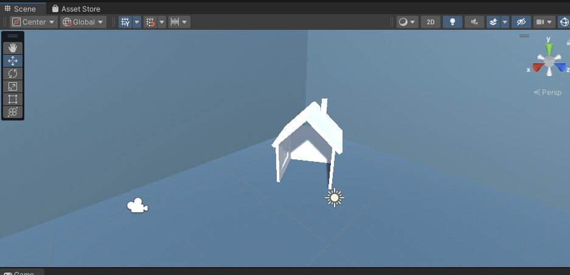
    
- 머티리얼 중요 파라미터
    - Rendering Mode : Opaque | Transparent
    - Albedo : 색상, 텍스처
    - Metalic : 금속 질감
        - Smootheness
    - ...


    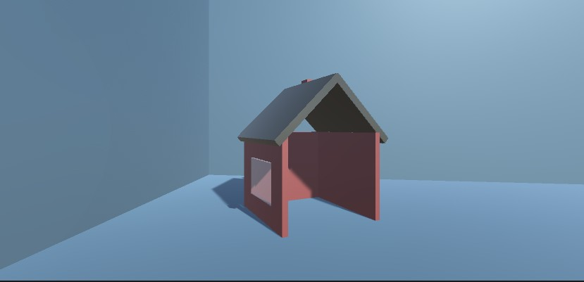


#### 프리팹

- 완전히 완성된 게임 오브젝트. 재사용 가능


### 유니티 실습

#### 존 레몬의 공포체험 

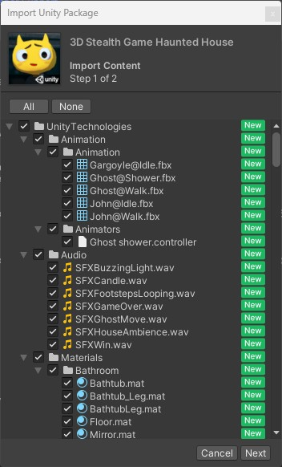

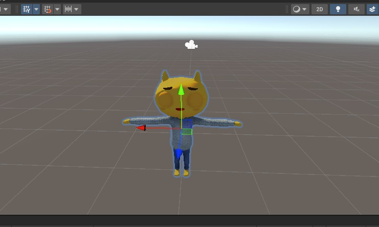

- 캐릭터 조정 : 플레이 상태에서 확인

    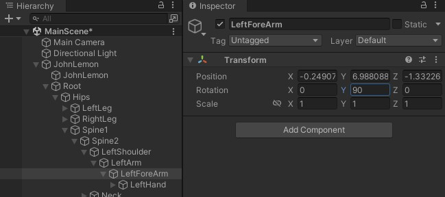

    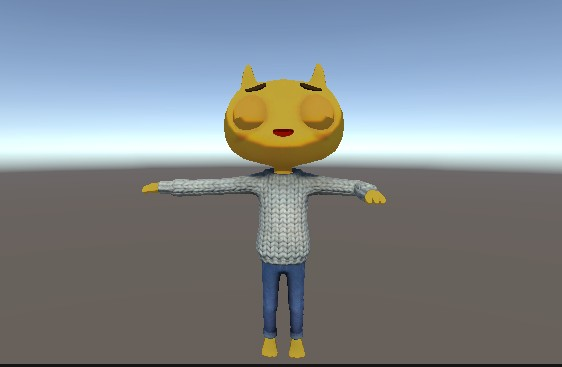

- 프리팹 변환 : 하이라키에서 프로젝트 프리팹으로 드래그

    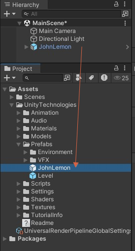

##### 캐릭터 애니메이션
- 오브젝트 인스펙터의 Animator 컴포넌트 확인
    - 하위 Animator 내
    - Controller 수정 : 상태머신 참조

    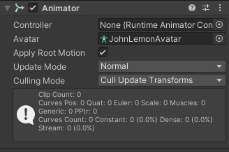

- 애니메이터 컨트롤러
    - Assets > Animation > Animators 폴더에서 Create > Animator Controller 클릭
    
    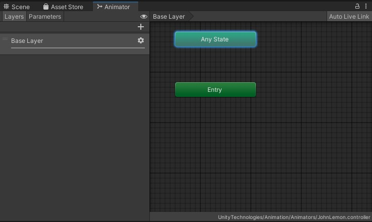

    - 애니메이터 화면 구성
        - 애니메이터 레이어 및 애니메이터 파라미터 수정을 위한 왼쪽 패널
        - 상태 머신을 표시하는 오른쪽 공간 : BaseLayer

    - Parameters 탭 클릭. 네가지 유형
        - `float` 파라미터는 부동 소수점 변수로 소수점을 포함
        - `int` 파라미터는 소수점이 없는 정수 값
        - `bool` 파라미터는 참 또는 거짓으로 표현되는 부울 방식의 값
        - `trigger` 파라미터는 값을 갖지 않는 특별한 형태의 파라미터이며, 한 애니메이션에서 다른 애니메이션으로의 변환을 유발

    - Parameters에 bool형 IsWalking 추가

    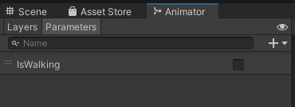

- 애니메이션 설정
    
    

    - 마우스 드래그로 상태머신 추가

    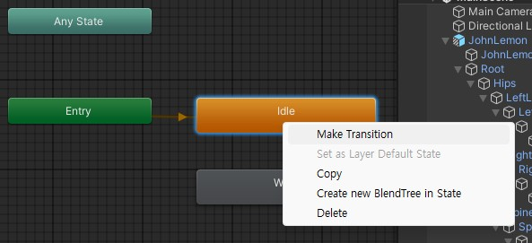

    - Make Transaction 으로 상태 변환 추가


    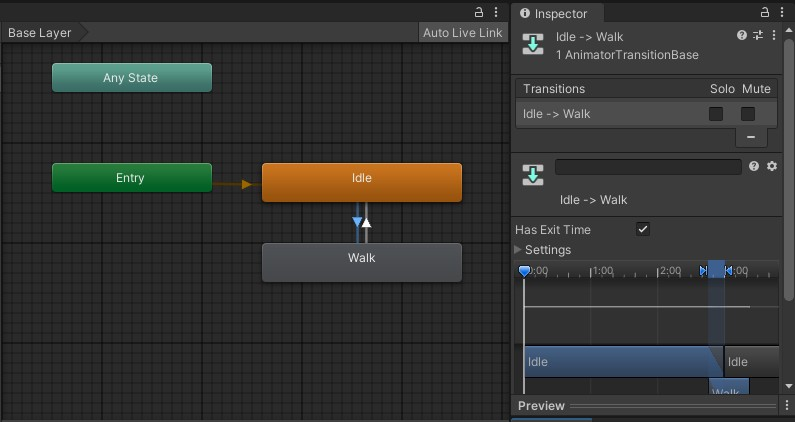

    - Transaction의 Inspector에서 Has Exit Time 체크박스 참이면 일정시간 후 전환이 자동 수행
    - Has Exit Time 체크해제
    - Conditions +버튼으로 상태별 추가

    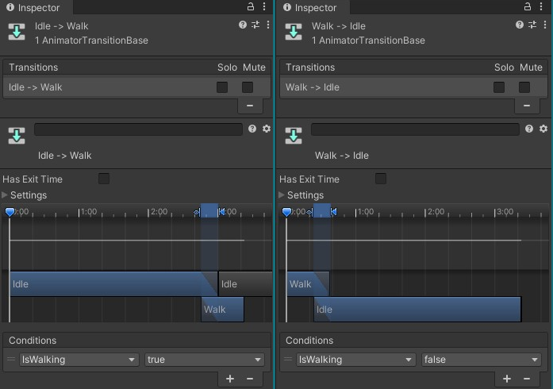

- Animator 컨트롤러에 JohnLemon 프리팹에 할당
    - JohnLemon 오브젝트 인스펙터 Animator의 Controller로 Project Animator의 JohnLemon을 드래그

    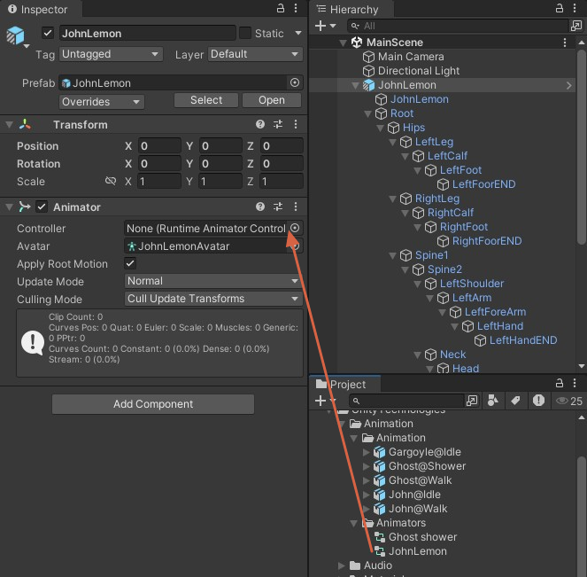

    - 실행 후 Amimator 탭의 IsWalking의 체크여부에 따라 애니메이션 변경 확인

    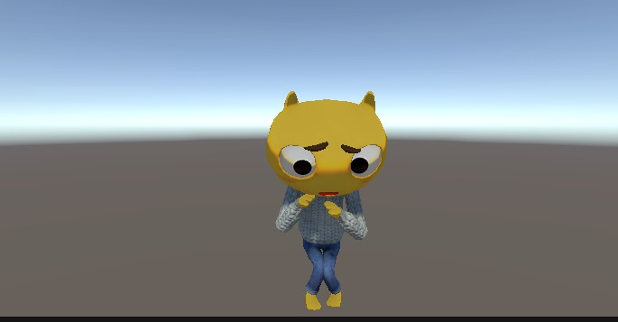


##### 물리속성 적용
- 캐릭터는 방과 복도가 여러개 있는 유령의 집을 탐색함. 캐릭터는 유령이 아니기 때문에 벽을 통과해서는 안됨

- JohnLemon 프리팹에 물리에 반응하도록 적용 필요
- 물리에 반응하도록 RigidBody와 Collider 컴포넌트 추가

    - RigidBody 추가

- 실행하면 하늘로 계속 올라감 - Apply Root Motion 활성화, Use Gravity 활성화 시 발생 

- Apply Root Motion, Use Gravity 체크 해제

- Capsule Collider 추가 [변경](#BoxCollider변경)

    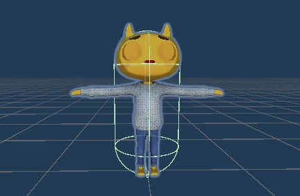

##### 캐릭터 움직임을 위한 스크립트

- MonoBehaviour 상속 클래스
- Project > Assets > Scripts 폴더 PlayerMovement C# Script 생성

    

    ```cs
    using System.Collections;
    using System.Collections.Generic;
    using UnityEngine;
    using static UnityEditor.Searcher.SearcherWindow.Alignment;

    public class PlayerMovement : MonoBehaviour
    {
        Vector3 m_Movement;   // 캐릭터의 이동 방향 벡터


        // 업데이트 이전에 호출됩니다.
        void Start()
        {
            
        }

        // 업데이트는 매 프레임 호출됩니다.
        void Update()
        { 
            float horizontal = Input.GetAxis("Horizontal"); // 수평으로 입력 받기
            float vertical = Input.GetAxis("Vertical"); // 수직으로 입력 받기   

            m_Movement.Set(horizontal, 0f, vertical); // 이동 벡터 설정
            m_Movement.Normalize(); // 벡터 정규화
        }
    }
    ```

- 애니메이터 컴포넌트 설정
    - 캐릭터가 걷고 있는지 여부를 Animator 컴포넌트에 알립니다.
    - 플레이어 입력에서 캐릭터 회전 값을 받아 옵니다(이동을 구한 방식과 유사).
    - 캐릭터에 이동과 회전을 적용합니다.

    - 플레이어 입력 감지 및 애니메이터 컴포넌트에 대한 레퍼런스 구하기

    ```cs
    Vector3 m_Movement;   // 캐릭터의 이동 방향 벡터
    Animator m_Animator;   // 

    // 업데이트는 매 프레임 호출됩니다.
    void Update()
    { 
        float horizontal = Input.GetAxis("Horizontal"); // 수평으로 입력 받기
        float vertical = Input.GetAxis("Vertical"); // 수직으로 입력 받기   

        m_Movement.Set(horizontal, 0f, vertical); // 이동 벡터 설정
        m_Movement.Normalize(); // 벡터 정규화

        bool hasHorizontalInput = !Mathf.Approximately(horizontal, 0f); // 수평 입력이 있는지 여부 판단
        bool hasVerticalInput = !Mathf.Approximately(vertical, 0f); // 수직 축에도 입력이 있는지 판단

        bool isWalking = hasHorizontalInput || hasVerticalInput;

    }
    ```

    - Animator 컴포넌트에 대한 레퍼런스 설정

    ```cs
    // 업데이트 이전에 호출됩니다.
    void Start()
    {
        m_Animator = GetComponent<Animator>();   // 애니메이터 컴포넌트 가져오기
    }

    // 업데이트는 매 프레임 호출됩니다.
    void Update()
    { 
        float horizontal = Input.GetAxis("Horizontal"); // 수평으로 입력 받기
        float vertical = Input.GetAxis("Vertical"); // 수직으로 입력 받기   


        m_Movement.Set(horizontal, 0f, vertical); // 이동 벡터 설정
        m_Movement.Normalize(); // 벡터 정규화

        bool hasHorizontalInput = !Mathf.Approximately(horizontal, 0f); // 수평 입력이 있는지 여부 판단
        bool hasVerticalInput = !Mathf.Approximately(vertical, 0f); // 수직 축에도 입력이 있는지 판단

        bool isWalking = hasHorizontalInput || hasVerticalInput;    // 걷고 있는지 여부 판단

        m_Animator.SetBool("IsWalking", isWalking);  // 애니메이터에 걷고 있는지 여부 전달

    }
    ```

    - 캐릭터 회전 생성

    ```cs
    public float turnSpeed = 20f;  // 회전 속도

    Vector3 m_Movement;   // 캐릭터의 이동 방향 벡터
    Animator m_Animator;   // 애니메이터 연결용
    Quaternion m_Rotation = Quaternion.identity; // 회전 값 저장용


    // 업데이트 이전에 호출됩니다.
    void Start()
    {
        m_Animator = GetComponent<Animator>();   // 애니메이터 컴포넌트 가져오기
    }

    // 업데이트는 매 프레임 호출됩니다.
    void Update()
    { 
        float horizontal = Input.GetAxis("Horizontal"); // 수평으로 입력 받기
        float vertical = Input.GetAxis("Vertical"); // 수직으로 입력 받기   


        m_Movement.Set(horizontal, 0f, vertical); // 이동 벡터 설정
        m_Movement.Normalize(); // 벡터 정규화

        bool hasHorizontalInput = !Mathf.Approximately(horizontal, 0f); // 수평 입력이 있는지 여부 판단
        bool hasVerticalInput = !Mathf.Approximately(vertical, 0f); // 수직 축에도 입력이 있는지 판단

        bool isWalking = hasHorizontalInput || hasVerticalInput;    // 걷고 있는지 여부 판단

        m_Animator.SetBool("IsWalking", isWalking);  // 애니메이터에 걷고 있는지 여부 전달

        // 캐릭터 회전 처리
        Vector3 desiredForward = Vector3.RotateTowards(transform.forward, m_Movement, turnSpeed * Time.deltaTime, 0f);
        m_Rotation = Quaternion.LookRotation(desiredForward);

    }
    ```

    - 캐릭터에 이동 및 회전 적용 및 Update 메서드 변경

    - 전체 완료 스크립트

    ```cs
    public class PlayerMovement : MonoBehaviour
    {
        public float turnSpeed = 20f;  // 회전 속도

        Vector3 m_Movement;   // 캐릭터의 이동 방향 벡터
        Animator m_Animator;   // 애니메이터 연결용
        Rigidbody m_Rigidbody;  // 리지드바디 연결용
        Quaternion m_Rotation = Quaternion.identity; // 회전 값 저장용


        // 업데이트 이전에 호출됩니다.
        void Start()
        {
            m_Animator = GetComponent<Animator>();   // 애니메이터 컴포넌트 가져오기
            m_Rigidbody = GetComponent<Rigidbody>(); // 리지드바디 컴포넌트 가져오기 
        }

        // 물리 업데이트 처리
        void FixedUpdate()
        { 
            float horizontal = Input.GetAxis("Horizontal"); // 수평으로 입력 받기
            float vertical = Input.GetAxis("Vertical"); // 수직으로 입력 받기   

            m_Movement.Set(horizontal, 0f, vertical); // 이동 벡터 설정
            m_Movement.Normalize(); // 벡터 정규화

            bool hasHorizontalInput = !Mathf.Approximately(horizontal, 0f); // 수평 입력이 있는지 여부 판단
            bool hasVerticalInput = !Mathf.Approximately(vertical, 0f); // 수직 축에도 입력이 있는지 판단
            bool isWalking = hasHorizontalInput || hasVerticalInput;    // 걷고 있는지 여부 판단

            m_Animator.SetBool("IsWalking", isWalking);  // 애니메이터에 걷고 있는지 여부 전달

            // 캐릭터 회전 처리
            Vector3 desiredForward = Vector3.RotateTowards(transform.forward, m_Movement, turnSpeed * Time.deltaTime, 0f);
            m_Rotation = Quaternion.LookRotation(desiredForward);
        }

        // 애니메이터 이동 처리
        void OnAnimatorMove()
        {
            // 리지드바디 위치 및 회전 갱신
            m_Rigidbody.MovePosition(m_Rigidbody.position + m_Movement * m_Animator.deltaPosition.magnitude);
            m_Rigidbody.MoveRotation(m_Rotation);
        }
    }

    ```

    - JohnLemon 프리팹에 PlayerMovement 스크립트 추가

        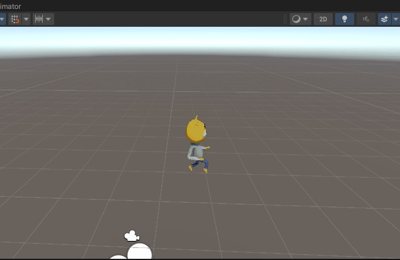

##### 게임 뷰 설정 조정

- 현재 Free Aspect 확인

    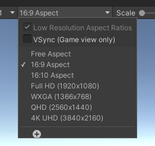

##### 환경 추가

<p id="BoxCollider변경">
  Capsule Collider를 Box Collider로 변경, 캐릭터 쓰러짐 현상
</p>

- 게임 레벨
    - Assets > Scenes 폴더 이동 MainScene 더블클릭 
    - Assets > Prefabs로 이동하여 Level Prefab을 선택

    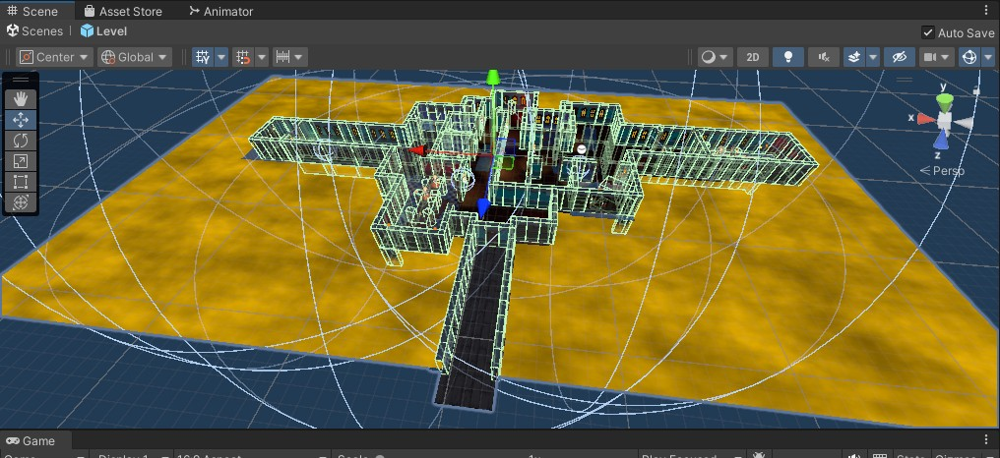

    - Level 프리팹을 프로젝트 창에서 계층 창으로 드래그하여 인스턴스화

    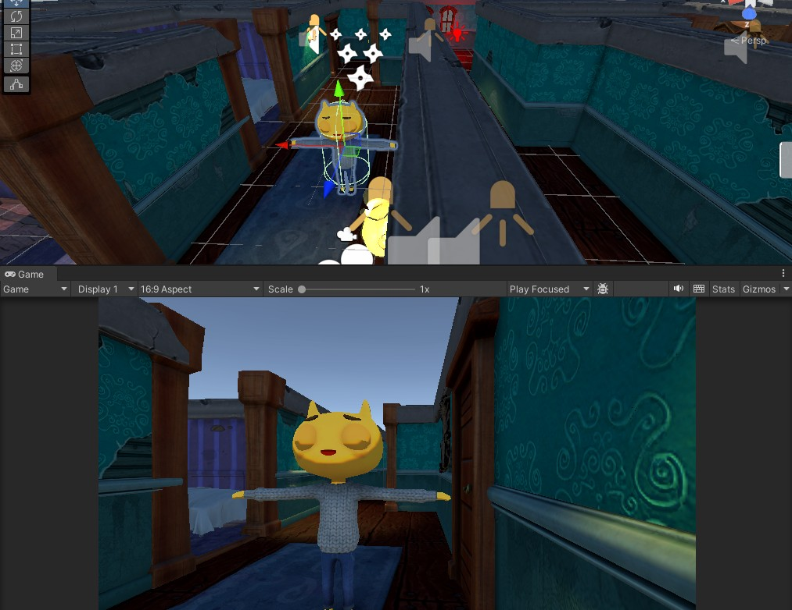

    - 플레이어 캐릭터 위치 지정
    - Transform 컴포넌트의 Position 프로퍼티를 (-9.8, 0, -3.2)로 설정

    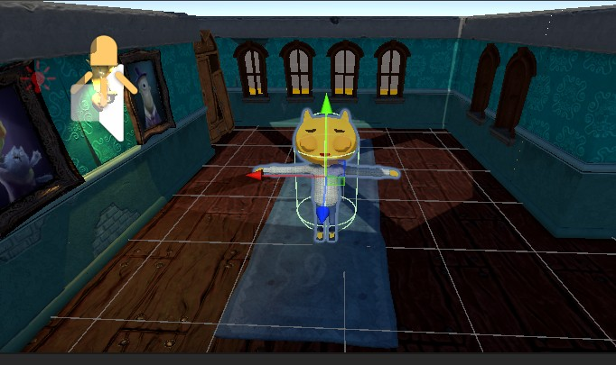

- 환경 광원 설정
    - 조명으로 분위기 변경
    - 계층창에서 Directional Light 선택
    - Color 프로퍼티 클릭
        - Color 프로퍼티를 (225, 240, 250)으로 설정. 옅은 파란색
        - Light 컴포넌트에서 Intensity 프로퍼티를 2
        - Light 컴포넌트에서 Realtime Shadows 프로퍼티
        - Resolution 프로퍼티를 Use Quality Settings에서 Very High Resolution으로 변경
        - Realtime Shadows Bias와 Normal Bias 프로퍼티를 0.01로 설정
        - Transform 컴포넌트에서 Rotation 프로퍼티를 (30, 20, 0)으로 설정

    - 직접 조명 및 간접 조명이라는 2가지 조명을 통해 실제 빛의 속성을 시뮬레이션
        - 메뉴 Window > Rendering > Lighting

        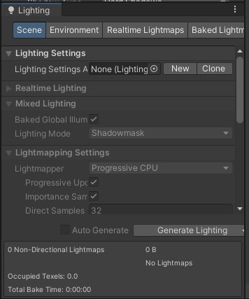

        - Lighting Settings에서 New 클릭
        - Realtime Lighting 섹션, Realtime Global Illumination 체크박스 선택 해제. Mixed Lighting 섹션 Baked Global Illumination 체크박스 선택
        - Environment 섹션에서 Skybox Material 프로퍼티 Default-Skybox에서 None으로 변경
        - Environment 섹션에서 Environment Lighting Source를 Gradient로 설정 

        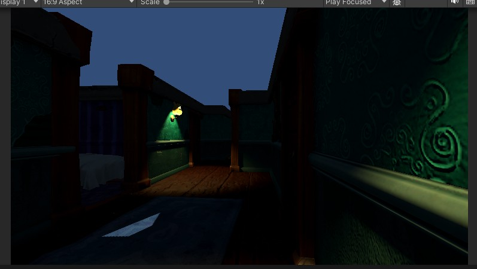

        - 이전까지 밝은 화면에서 어두운 화면으로 변경됨
        - 그레디언트는 전체 씬을 감싸는 커다란 구체와 동일
        - Sky(씬 위에서 내려오는 환경 광원) 컬러를 더 옅은 회색으로 설정 (170, 180, 200)
        - Equator(지평선에서 씬 중앙으로 이동하는 광원) 컬러를 청회색으로 설정 (90, 110, 130)
        - Ground(씬 아래에서 올라오는 광원) 컬러를 검정색으로 설정 (0, 0, 0)

##### 내비게이션 메시
- 유령이 돌아다닐 수 있도록 하기 위해 내비메시(NavMesh, 내비게이션 메시)라는 빌트인 시스템을 이용
- 내비메시는 보이지 않는 셰이프로, 선택한 게임 오브젝트가 이동할 수 있는 영역을 정의
- 게임 오브젝트가 `정적(static)`으로 지정되어 있으면 Unity의 내비게이션 시스템은 해당 게임 오브젝트가 이동하지 않을 것으로 추정

- 계층구조에서 Level 오브젝트 선택

    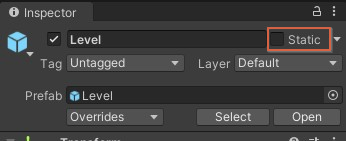

    - Static 체크박스 체크

    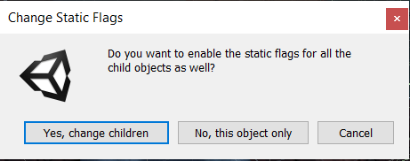

    - 모든 자식 오브젝트에도 정적 플래그를 활성화할 것인지 묻는 대화창. Yes... 선택

- 이제 Level 게임 오브젝트와 모든 자식 게임 오브젝트가 정적으로 표시되었는데, 한 가지 예외를 설정해야 함. 레벨 디자인에는 그림자를 드리우는 데 사용되는 Ceiling Plane 게임 오브젝트. 이 게임 오브젝트를 베이크에 포함시키면 유령이 천장에서 걸어 다니게 됨. 

    - Level > Corridors > Dressing > Ceiling Plane으로 이동하여 Ceiling Plane 게임 오브젝트를 선택
    - 인스펙터에서 Static 체크박스를 선택 해제

- 네비메시 생성
    - 베이킹 - 네비메시 생성하는 과정을 뜻하는 용어
    - Window > AI > Navigation 선택

    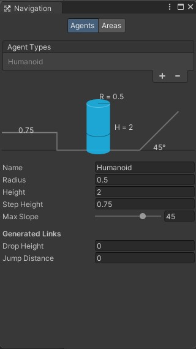

    - Unity 6.0에서는 Bake 기능이 사라짐. 대신 NavMesh Surface라는 컴포넌트를 통해 베이크를 직접 제어로 변경

    - Agent Ghost 추가
    - Level > Corridors > Dressing > FloorPlane 선택 Inspector에 `NavMeshSurface` 컴포넌트 추가
    
    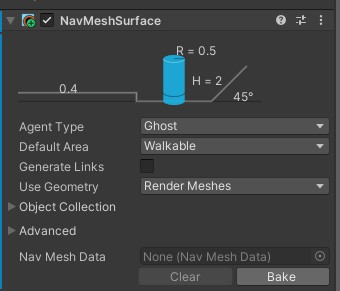

    - Bake 버튼 클릭

    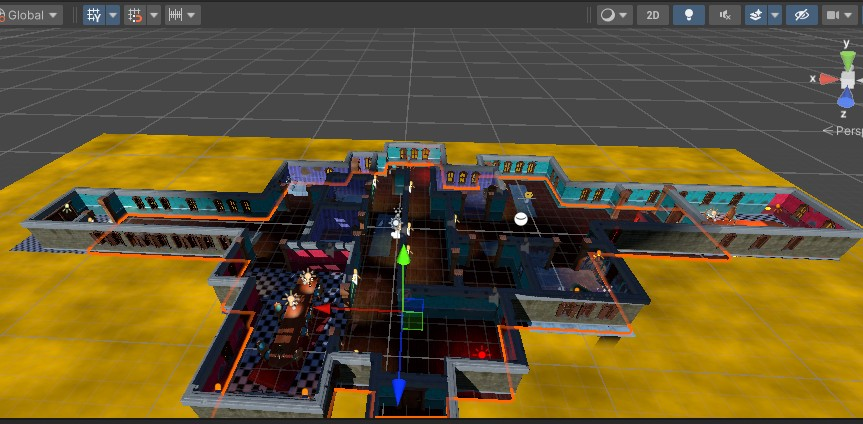

    - Bake 전

    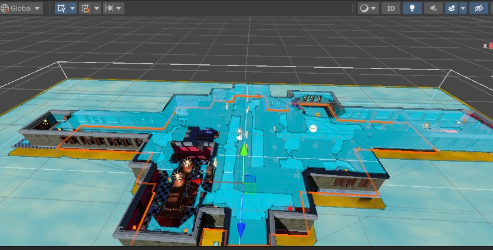

    - Bake 후

    - 유령(적)이 돌아다닐 수 있는 네비게이션을 베이크

##### 카메라와 포스트 프로세싱

- Camera 컴포넌트 : 카메라 설정을 조정하여 캐릭터가 카메라 밖으로 벗어나지 않도록

    - 카메라 컴포넌트도 이전 버전과 프로퍼티가 많이 변경됨

    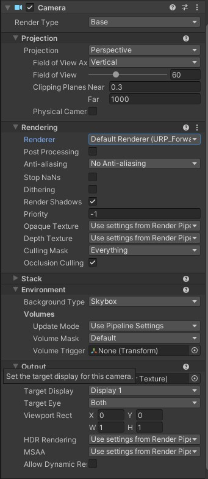

- 시네머신
    - 씬에서 하나 이상의 가상 카메라를 생성
    - Cinemachine Brain 컴포넌트에서 관리
    - Cinemachine Brain 컴포넌트는 Camera 컴포넌트가 포함된 게임 오브젝트에 연결되며, 기본적으로 이는 Main Camera 게임 오브젝트가 됨
    - Cinemachine Brain에서 모든 가상 카메라를 관리하며 실제 카메라가 어떤 가상 카메라(혹은 가상 카메라의 조합)를 따라야 하는지를 결정

    - JohnLemon 오브젝트 선택 후 마우스오른쪽 버튼 컨텍스트 메뉴에서 Cinemachine > Virtual Camera 선택

    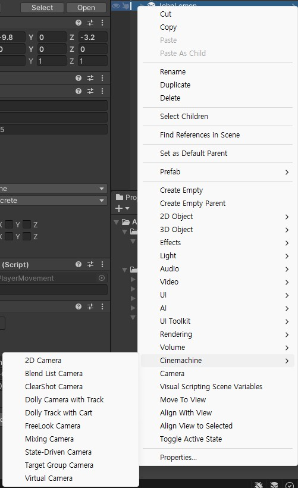

    - Aim 섹션 Composer에서 Do Nothing 으로
    - Follow JohnLemon 오브젝트 드래그
    - Body 섹션에서 오른쪽 상단의 드롭다운을 Transposer에서 Framing Transposer로 변경

    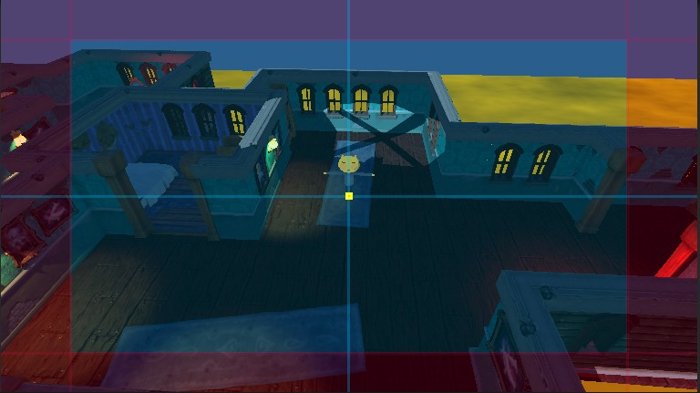

    - Virtual Camera Transform의 Rotation Y를 0으로 변경
    - Body > Camera Distance 를 10에서 4로 변경

    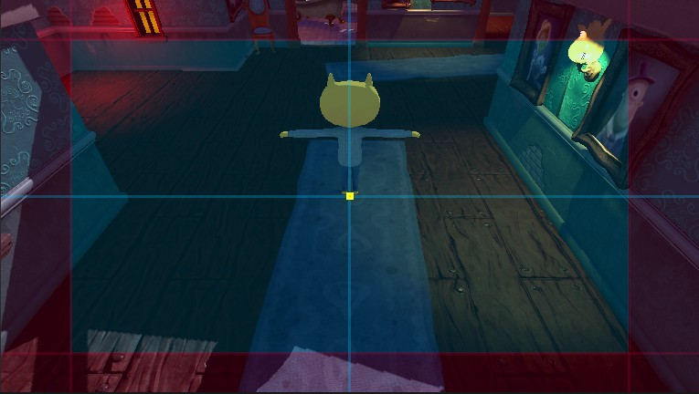

    - 플레이 화면

    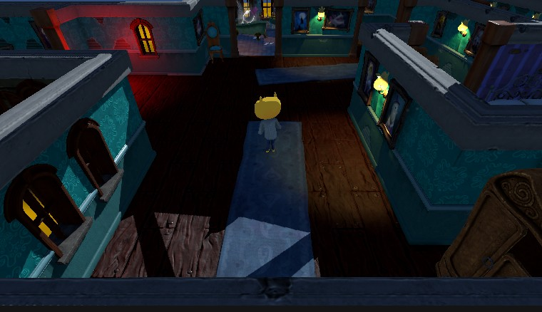


##### 시점에 따른 캐릭터 이동 변경

- 가상 카메라 시점에 맞춰 캐릭터 이동 변경 스크립트

    ```cs
    public class PlayerMovement : MonoBehaviour
    {
        public float turnSpeed = 2000f;  // 회전 속도

        Vector3 m_Movement;   // 캐릭터의 이동 방향 벡터
        Animator m_Animator;   // 애니메이터 연결용
        Rigidbody m_Rigidbody;  // 리지드바디 연결용
        Quaternion m_Rotation = Quaternion.identity; // 회전 값 저장용

        float horizontal;                // 좌우 입력
        float vertical;                  // 앞/뒤 입력

        // 업데이트 이전에 호출됩니다.
        void Start()
        {
            m_Animator = GetComponent<Animator>();   // 애니메이터 컴포넌트 가져오기
            m_Rigidbody = GetComponent<Rigidbody>(); // 리지드바디 컴포넌트 가져오기 
        }

        // 물리 업데이트 처리
        void FixedUpdate()
        { 
            horizontal = Input.GetAxis("Horizontal"); // 수평으로 입력 받기
            vertical = Input.GetAxis("Vertical"); // 수직으로 입력 받기   

            // 앞/뒤 이동 벡터만 계산 (좌우는 이동 X)
            if (vertical > 0f)
                m_Movement = transform.forward;        // 전진
            else if (vertical < 0f)
                m_Movement = -transform.forward;       // 후진(뒷걸음질)
            else
                m_Movement = Vector3.zero;             // 정지


            // 애니메이터 파라미터 (원하는 대로 바꾸세요)
            // - IsWalking: 전/후진 중일 때 true
            // - Speed: 전/후진 방향을 구분하려면 float 파라미터로 사용(Blend Tree에 유용)
            bool isMoving = !Mathf.Approximately(vertical, 0f);
            m_Animator.SetBool("IsWalking", isMoving);
            m_Animator.SetFloat("Speed", vertical); // 선택 사항(Blend Tree 쓰는 경우)
        }

        // 애니메이터 이동 처리
        void OnAnimatorMove()
        {
            // 리지드바디 위치 및 회전 갱신
            //m_Rigidbody.MovePosition(m_Rigidbody.position + m_Movement * m_Animator.deltaPosition.magnitude);
            //m_Rigidbody.MoveRotation(m_Rotation);

            // 1) 회전: 좌우 입력 만큼 제자리에서 회전만 수행
            if (!Mathf.Approximately(horizontal, 0f))
            {
                float turn = horizontal * turnSpeed * Time.deltaTime;
                Quaternion turnRot = Quaternion.Euler(0f, turn, 0f);
                m_Rigidbody.MoveRotation(m_Rigidbody.rotation * turnRot);
            }

            // 2) 이동: 앞/뒤 입력이 있을 때만 Root Motion 거리만큼 이동
            if (m_Movement != Vector3.zero)
            {
                // deltaPosition.magnitude = 이번 프레임 애니메이션이 제시하는 "이동량"
                Vector3 delta = m_Movement * m_Animator.deltaPosition.magnitude;
                m_Rigidbody.MovePosition(m_Rigidbody.position + delta);
            }
        }
    }
    ```

- 실행결과

  https://github.com/user-attachments/assets/ff9fb85d-9aa9-4960-b19f-8a680f87beb9


##### 카메라 포스트 프로세싱(나중에 다시)

- 사진에 필터를 적용하듯이 게임 이미지를 화면에 렌더링하기 전에 필터 및 효과를 적용하는 작업
- 인스펙터 게임 오브젝트 Layer 프로퍼티 
- Add Layer : 32개의 레이어 존재

    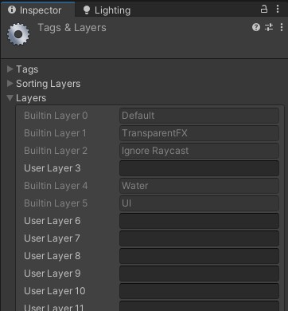

- "PostProcessingVolumes"를 User Layer 8 추가
- Post Process Layer 컴포넌트를 Main Camera에 추가

##### 안티앨리어싱 이미지 품질 개선
- Post Process Layer 컴포넌트에서 Mode 프로퍼티 드롭다운을 No Anti-aliasing에서 Fast Approximate Anti-aliasing(FXAA)으로 변경
- 드롭다운 아래의 Fast Mode 체크박스를 활성화

- 포스트 프로세싱 볼륨
    - 계층 창에서 Create > Create Empty
    - 새 게임 오브젝트의 이름을 “GlobalPost”로 지정
    - Is Global 체크박스를 활성화
    - 인스펙터에서 레이어를 PostProcessingVolumes로 설정
    - Transform 컴포넌트의 Position 프로퍼티를 (0, 0, 0)으로 변경. 이 게임 오브젝트가 글로벌 포스트 프로세스 볼륨이 됨
    - GlobalPost에 Post Process Volume 컴포넌트를 추가

    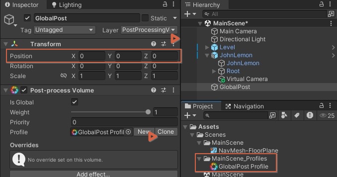

- 컬러 그레이딩 효과 추가
    - Post-process Volume 맨 아래의 Add effect 클릭
    - Unity > color grading 선택

    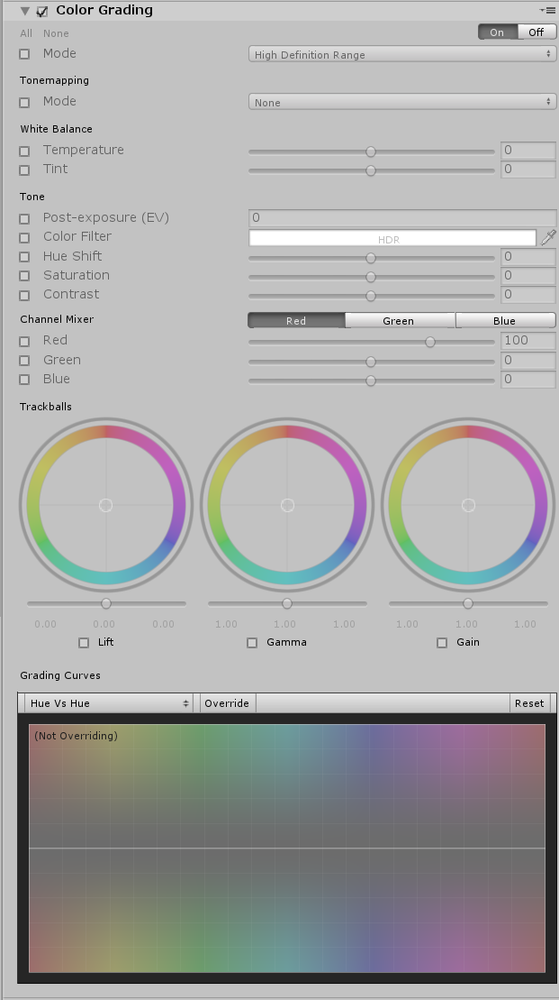


##### UI 설정

- 게임을 페이드아웃하려면 Unity의 UI(사용자 인터페이스) 시스템을 사용
    - 계층 창에서 +(Create) > UI > Image 선택

    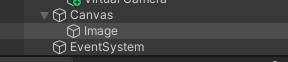

    - Canvas 게임 오브젝트를 선택. F키로 포커스 온

    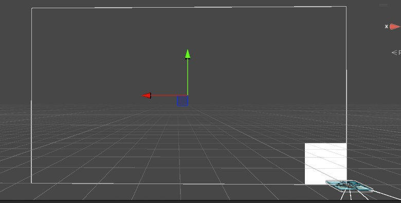

    - 계층 구조에서 EventSystem 게임 오브젝트를 선택(상호작용을 위한 오브젝트) 후 삭제

- 캔버스 설정
    - Canvas의 이름을 FaderCanvas로 변경

    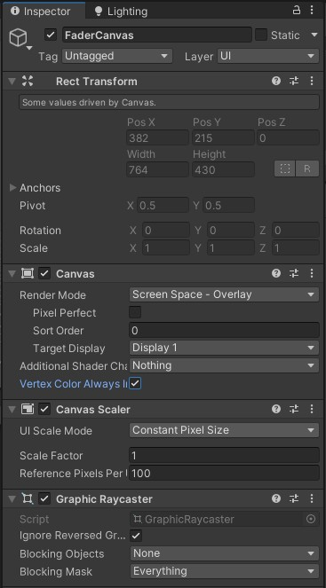

    - Render Mode 설정
        - **Screen Space - Overlay**: 캔버스가 화면을 채우고 캔버스의 모든 UI 요소가 모든 항목 위에 렌더링되는 모드
        - Screen Space - Camera: 캔버스가 화면을 채우지만, 특정 카메라로 렌더링되고 카메라의 거리에 영향을 받는 모드
        - World Space: 씬에 UI가 있으며 다른 오브젝트의 앞이나 뒤에 렌더링되는 모드(예: 3D 월드에서 캐릭터 위에 표시되는 이름 태그)

    -  Canvas Scaler 컴포넌트를 이용하면 다양한 크기의 화면에서 UI 요소의 상대적인 크기를 조정 가능 - 현재는 필요없어 삭제
    - Graphic Raycaster 컴포넌트는 클릭과 같은 UI 이벤트를 감지, 역시 필요없음. 삭제

- 이미지 늘리기
    - 계층 구조의 Image 선택, 크기 및 위치 변경
    - Image 객체, Image 프로퍼티 Color 선택 후 검정으로 변경

    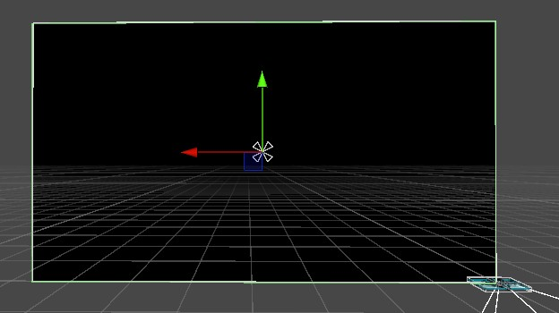

- 미션 완료 이미지 추가

    - 계층 구조에서 현재 Image 게임 오브젝트의 이름을 ExitImageBackground로 변경
    - 하위에 이미지 오브잭트 ExitImage 추가
    - Source Image 프로퍼티의 동그란 선택 버튼을 클릭, Won 선택

    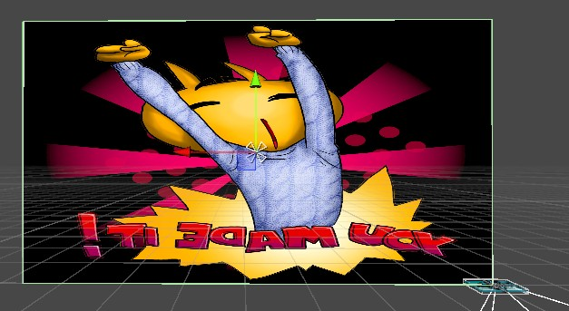

    - Rect Transform 컴포넌트를 찾습니다. Anchors 설정을 펼치기
    - x 및 y의 최솟값을 0으로 설정하고, x 및 y의 최댓값을 1로 설정
    - Left, Right, Top 및 Bottom 프로퍼티를 0으로 설정
    - Image Type 프로퍼티, Preserve Aspect 체크박스를 활성화

- Canvas Group 컴포넌트 추가
    - UI 요소를 원하는 때에 페이드인 및 페이드아웃하도록 
    - ExitImageBackground 게임 오브젝트 선택
    - 인스펙터에서 Canvas Group 컴포넌트를 추가
    - Alpha 1 -> 0으로 변경

    - JohnLemon 오브젝트 클릭후 F

- GameEnding 트리거 생성
    - JohnLemon이 유령의 집에서 탈출했는지 여부를 인식하여 Canvas Group의 Alpha 프로퍼티 값을 언제 변경할지 파악
    - Trigger : 트리거는 이동을 방해하지 않는 콜라이더
    - 계층 창에서 Create 메뉴를 클릭하고 Create Empty를 선택 > GameEnding 이름 변경
    - IsTrigger 체크
    - GameEnding 트랜스폼의 Position을 (18, 1, 1.5)로 설정
    - Box Collider 컴포넌트를 추가

    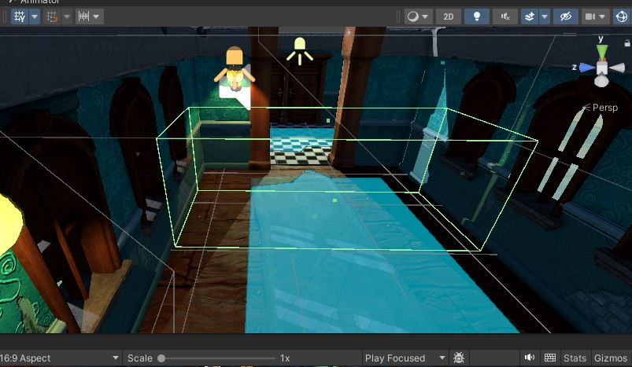

    - C# 스크립트 생성

    ```cs
    public class GameEnding : MonoBehaviour
    {
        public float fadeDuration = 1f;  // 페이드아웃 간격
        public GameObject player;  // 트리거가 발생할 오브젝트
        public float displayImageDuration = 1f;
        public CanvasGroup exitBackgroundImageCanvasGroup;

        bool m_IsPlayerAtExit;
        float m_Timer;

        // Start is called before the first frame update
        void Start()
        {
            
        }

        // Update is called once per frame
        void Update()
        {
            if (m_IsPlayerAtExit)  // 플레이어가 트리거 영역에 들어왔는지 확인
            {
                EndLevel();
            }
        }

        private void EndLevel()
        {
            m_Timer += Time.deltaTime;  // 경과 시간 누적

            exitBackgroundImageCanvasGroup.alpha = m_Timer / fadeDuration;  // 페이드아웃 효과 적용

            if (m_Timer > fadeDuration + displayImageDuration)
            {
                Application.Quit();  // 게임 종료
            }
        }

        // 이 클래스는 먼저 플레이어가 제어하는 게임 오브젝트를 감지해야 함
        void OnTriggerEnter(Collider other)
        {
            if (other.gameObject == player)  // 트리거 영역에 플레이어가 들어왔는지 확인
            {
                m_IsPlayerAtExit = true; // 트리거 상태 설정
            }
        }
    }
    ```

- GameEnding 스크립트에 대한 변수 설정

    - 계층 구조에서 GameEnding 게임 오브젝트를 선택

    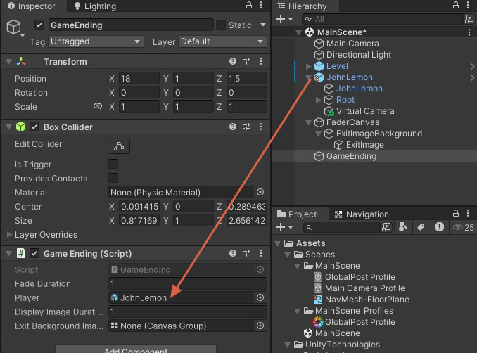

    - 계층 구조에서 FaderCanvas > ExitImageBackground 를 Game Ending 컴포넌트의 Exit Background Image Canvas Group 필드로 드래그

- 실행결과

    https://github.com/user-attachments/assets/8a817fc5-16c7-4e5d-836e-ebee3fab8294


##### 적 캐릭터 생성, 정적 관찰자

- 가고일 프리팹
    - 프로젝트 창에서 Assets > Models 폴더로 이동하여 Gargoyle 에셋 확인, 계츷창으로 드래그
    - 모델은 읽기 전용이기 때문에 프리팹을 생성한 후 변경

    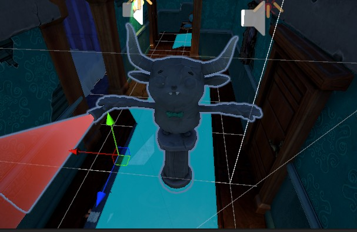

- 가고일 애니메이션화
    - 프로젝트 창에서 Assets > Animation > Animators 폴더로 이동하여 오른쪽 클릭
    - 컨텍스트 메뉴에서 Create > Animator Controller를 선택. 새로운 애니메이션 컨트롤러의 이름을 `Gargoyle`로 설정
    - Gargoyle을 더블 클릭하여 Animator 창 오픈
    - 프로젝트 창에서 Assets > Animation > Animations로 이동
    - Idle 애니메이션을 프로젝트 창에서 Animator 창으로 드래그. 애니메이터의 Idle 상태가 생성

    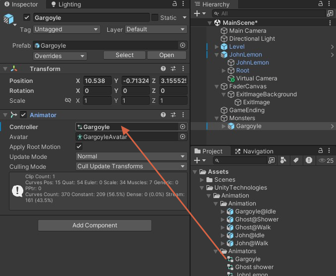

    - 실행후 애니메이션 확인

    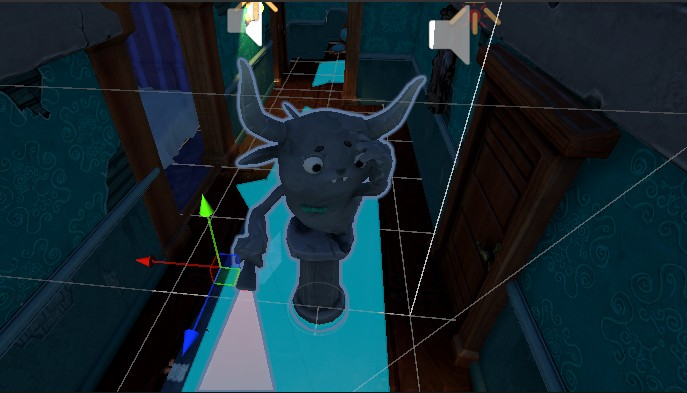

- 가고일에 콜라이더 추가

    - 플레이어가 가고일과 부딪히고, 또 가고일이 손전등 불빛으로 JohnLemon을 볼 수 있도록

    - 인스펙터에서 Gargoyle 게임 오브젝트에 Capsule Collider 컴포넌트를 추가

    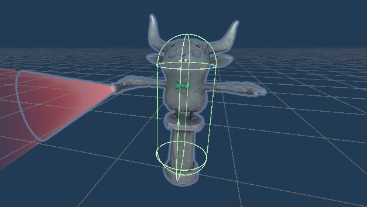

    - Capsule Collider의 Center 프로퍼티를 (0, 0.9, 0)으로 변경
    - Radius 프로퍼티를 0.3으로 변경
    - Height 프로퍼티를 1.8로 변경

- 가고일 가시선 시뮬레이션을 위한 트리거 생성

    - 트리거를 생성한 후 가고일이 벽 너머를 보지 못하도록 하는 커스텀 스크립트를 작성
    - 계층 창에서 Gargoyle 게임 오브젝트를 오른쪽 클릭하고 Create Empty를 선택 
    - `PointOfView` 로 이름 설정
    - Position 프로퍼티를 (0, 1.4, 0.4)로 변경
    - Rotation 프로퍼티를 (20, 0, 0)으로 변경
    - PointOfView Global -> Local로 변경

    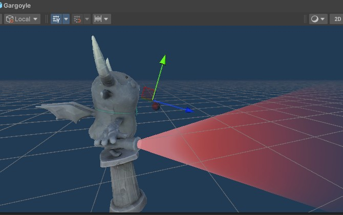

    - 가고일 시점에 트리거를 추가
    - PointOfView 인스펙터에서 Capsule Collider 컴포넌트를 추가
    - 컴포넌트의 Is Trigger 체크박스를 활성화
    - Capsule Collider의 Center 프로퍼티를 (0, 0, 0.95)로 변경
    - Radius 프로퍼티를 0.7로 변경
    - Height 프로퍼티를 2로 변경
    - Direction 프로퍼티를 Y-Axis에서 Z-Axis
 로 변경

    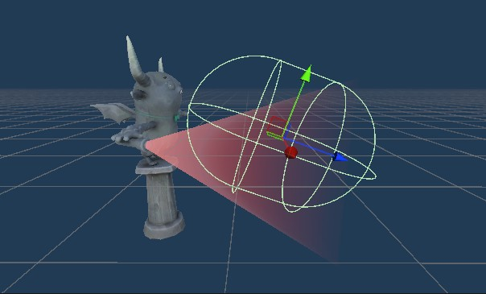

- 커스텀 Observer 스크립트 작성

    - JohnLemon이 트리거 영역으로 걸어 들어갔을 때 벌어질 일에 대한 스크립트를 작성
    - 프로젝트 창에서 Assets > Scripts로 이동
    - Scripts 폴더를 오른쪽 클릭하고 Create > C# Script를 선택. 새로운 스크립트의 이름을 `Observer`로 설정

    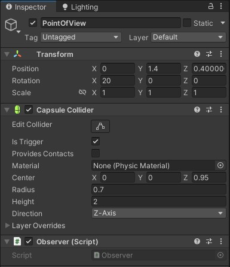

    - 적의 가시선 확인 추가

    ```cs
    public class Observer : MonoBehaviour
    {
        public Transform player;  // 플레이어의 Transform 참조
        public GameEnding gameEnding; // GameEnding 스크립트 참조

        bool m_IsPlayerInRange;   // 플레이어가 트리거 영역에 있는지 여부

        void OnTriggerEnter(Collider other)
        {
            if (other.transform == player)
            {
                m_IsPlayerInRange = true;   // 플레이어가 트리거 영역에 들어옴
            }
        }

        void OnTriggerExit(Collider other)
        {
            if (other.transform == player)
            {
                m_IsPlayerInRange = false;      //  플레이어가 트리거 영역에서 나감
            }
        }

        void Update()
        {
            if (m_IsPlayerInRange)  // 플레이어가 트리거 영역에 있을 때
            {
                // 플레이어와 관찰자 사이에 장애물이 있는지 확인
                Vector3 direction = player.position - transform.position + Vector3.up;
                Ray ray = new Ray(transform.position, direction);
                RaycastHit raycastHit;

                // 레이캐스트가 플레이어에 닿는지 확인
                if (Physics.Raycast(ray, out raycastHit))
                {
                    if (raycastHit.collider.transform == player)  // 장애물이 없으면
                    {
                        gameEnding.CaughtPlayer();
                    }
                }
            }
        }
    }
    ```

- GameEnding 스크립트 수정

    - 플레이어가 적에게 잡힐 때 게임을 종료하는 대신 레벨을 재시작할 수 있도록 스크립트를 수정

    ```cs
    public class GameEnding : MonoBehaviour
    {
        public float fadeDuration = 1f;  // 페이드아웃 간격
        public float displayImageDuration = 1f;   // 이미지 표시 시간
        public GameObject player;  // 트리거가 발생할 오브젝트

        public CanvasGroup exitBackgroundImageCanvasGroup;   // 페이드아웃에 사용할 캔버스 그룹
        public CanvasGroup caughtBackgroundImageCanvasGroup;    // 잡혔을 때 사용할 캔버스 그룹

        bool m_IsPlayerAtExit;  // 플레이어가 트리거 영역에 있는지 여부
        bool m_IsPlayerCaught;  // 플레이어가 잡혔는지 여부
        float m_Timer;    // 경과 시간

        // 이 클래스는 먼저 플레이어가 제어하는 게임 오브젝트를 감지해야 함
        void OnTriggerEnter(Collider other)
        {
            if (other.gameObject == player)  // 트리거 영역에 플레이어가 들어왔는지 확인
            {
                m_IsPlayerAtExit = true; // 트리거 상태 설정
            }
        }

        // 플레이어가 잡혔을 때 호출되는 메서드
        public void CaughtPlayer()
        {
            m_IsPlayerCaught = true;
        }

        // Update is called once per frame
        void Update()
        {
            if (m_IsPlayerAtExit)  // 플레이어가 트리거 영역에 들어왔는지 확인
            {
                EndLevel(exitBackgroundImageCanvasGroup, false);
            }
            else if (m_IsPlayerCaught)  // 플레이어가 잡혔는지 확인
            {
                EndLevel(caughtBackgroundImageCanvasGroup, true);
            }
        }

        // 레벨 종료 처리
        void EndLevel(CanvasGroup imageCanvasGroup, bool doRestart)
        {
            m_Timer += Time.deltaTime;  // 경과 시간 누적
            imageCanvasGroup.alpha = m_Timer / fadeDuration;  // 페이드아웃 효과 적용

            if (m_Timer > fadeDuration + displayImageDuration) // 지정된 시간이 지나면
            {
                if (doRestart)  // 재시작 여부에 따라
                {
                    SceneManager.LoadScene(0); // 첫 번째 씬(인덱스 0)으로 재시작
                }
                else
                {
                    Application.Quit();  // 애플리케이션 종료
                }
            }
        }
    }
    ```

- 가고일 프리팹 완성

    - Observer 스크립트 작업
        - 플레이어 캐릭터가 트리거에 있는 시점을 파악
        - 레이캐스트를 사용하여 콜라이더에 부딪혔는지 체크
        - 콜라이더가 플레이어 캐릭터인지 여부를 식별

    - Observer 스크립트를 저장하고 Unity로 복귀
    - 가고일 프리팹 인스턴스는 이후에 더 추가할 수 있으며, 지금은 가지고 있는 프리팹을 제일 처음 방의 구석에 배치
    - Position 프로퍼티를 (-15.2, 0, 0.8)로 변경
    - Rotation 프로퍼티를 (0, 135, 0)으로 변경
    - 계층 창에 있는 JohnLemon 게임 오브젝트를 인스펙터 내 Observer 스크립트의 Player 필드로 드래그

    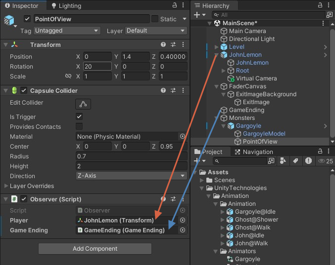

    - 계층 창에서 FaderCanvas 게임 오브젝트
    - ExitImageBackground 게임 오브젝트를 오른쪽 클릭하고 컨텍스트 메뉴에서 Duplicate를 선택
    - 새로운 복사본의 이름을 CaughtImageBackground로 변경
    - ExitImage 게임 오브젝트의 이름을 CaughtImage로 변경
    - Image 컴포넌트에서 Source Image 프로퍼티 옆의 원형 선택 버튼을 클릭합니다. 대화창이 열리면 Caught라는 스프라이트를 선택
    - Game Ending 스크립트의 Caught Background Image Canvas Group에 레퍼런스를 할당필요. 계층 창에서 GameEnding 게임 오브젝트를 선택
    - CaughtImageBackground 게임 오브젝트를 인스펙터 내 Game Ending 컴포넌트의 Caught Background Image Canvas Group 필드로 드래그

    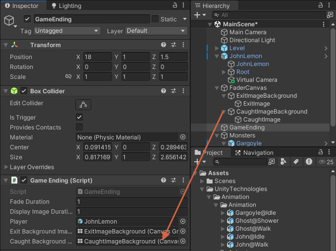

- 실행결과


