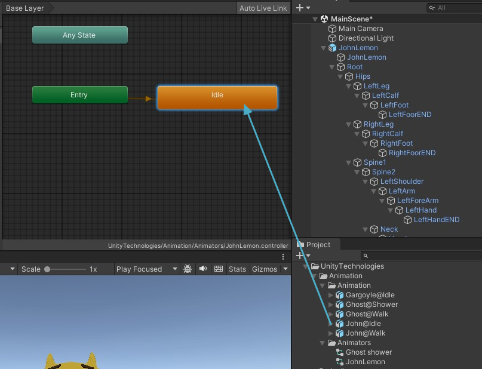
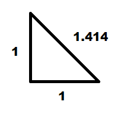

## Unity Learn

### Unity 핵심 기초

- [Unity Tutorial](https://learn.unity.com/tutorial/unity-editeo-ihae?uv=2020.3&courseId=614c0b2fedbc2a47200dce44&projectId=614bdef2edbc2a3d83d75f48#)
    - 내 Tutorial1&2_GettingStarted.zip 사용

    

    - 이동 : 마우스 오른쪽 버튼 + WSAD
    - 회전 : 마우스 오른쪽 버튼

- UnityStudy01 : 오브젝트 선택 

    

- 카메라 프로젝션
    1. Perspective
    2. Orthographic

#### 물리엔진

- Collider : 콜라이더 

    

- Trigger : 트리거
    - 오브젝트가 트리거 영역에 들어가거나 나올 때 이벤트 호출

- RigidBody : 리지드바디
    - 중력 프로퍼티

- Collision Detection : 출동 탐지
    - 스크립트

    ```cs
    // 충돌이 인식되면
    void OnCollisionEnter(Collision collision) {
        if (collision.gameObject.CompareTag("Enemy")) {
            // Hit the enemy
        }
    }

    // 충돌 중에 호출
    void OnCollisionStay(Collision collision) {
        // ...
    }

    // 충돌이 정지하면 호출
    void OnCollisionExit(Collision collision) {
        // ...
    }

    // 중력 활성화/비활성화
    bool rigidBody.useGravity;

    // 특정방향으로 힘 추가
    *rigidBody.AddForce(Vector3);

    // 축 주위 회전력 추가
    rigidbody.AddTorque(Vector3, Force Mode)
    ```

- Force Mode : 힘 모드
    - Acceleration : 일정한 비율로 증가하는 힘 적용
    - Force : 기본 설정, 질량을 고려하여 힘이 점진적으로 적용
    - Impulse : 순간적인 힘 적용
    - VelocityChange : 다양한 방향으로 순간적인 힘 적용. 질량을 무시됨

- Update 함수
    - Update : 프레임당 한 번 호출
    - FixedUpdate : 프레임당 여러번 호출. 물리 계산 등 

- 물리 머티리얼 : 표면 마찰 등 다른 표면과 상호작용 방식 제어

- 물리 조인트 : 리지드 바디를 또 다른 리지드 바디나 공간 내 정해진 지점에 연결. 관절등의 기능 구현에 사용

- 래이 캐스팅 : 물리 오브젝트와 다른 오브젝트 간의 광선 또는 보이지 않는 연결을 캐스트

#### 머티리얼

- 질감 표현

    
    
- 머티리얼 중요 파라미터
    - Rendering Mode : Opaque | Transparent
    - Albedo : 색상, 텍스처
    - Metalic : 금속 질감
        - Smootheness
    - ...


    


#### 프리팹

- 완전히 완성된 게임 오브젝트. 재사용 가능


### 유니티 실습

#### 존 레몬의 공포체험 


- 캐릭터 조정 : 플레이 상태에서 확인

    

    

- 프리팹 변환 : 하이라키에서 프로젝트 프리팹으로 드래그

    

##### 캐릭터 애니메이션
- 오브젝트 인스펙터의 Animator 컴포넌트 확인
    - 하위 Animator 내
    - Controller 수정 : 상태머신 참조

    

- 애니메이터 컨트롤러
    - Assets > Animation > Animators 폴더에서 Create > Animator Controller 클릭
    
    

    - 애니메이터 화면 구성
        - 애니메이터 레이어 및 애니메이터 파라미터 수정을 위한 왼쪽 패널
        - 상태 머신을 표시하는 오른쪽 공간 : BaseLayer

    - Parameters 탭 클릭. 네가지 유형
        - `float` 파라미터는 부동 소수점 변수로 소수점을 포함
        - `int` 파라미터는 소수점이 없는 정수 값
        - `bool` 파라미터는 참 또는 거짓으로 표현되는 부울 방식의 값
        - `trigger` 파라미터는 값을 갖지 않는 특별한 형태의 파라미터이며, 한 애니메이션에서 다른 애니메이션으로의 변환을 유발

    - Parameters에 bool형 IsWalking 추가

    

- 애니메이션 설정
    
    

    - 마우스 드래그로 상태머신 추가

    

    - Make Transaction 으로 상태 변환 추가


    

    - Transaction의 Inspector에서 Has Exit Time 체크박스 참이면 일정시간 후 전환이 자동 수행
    - Has Exit Time 체크해제
    - Conditions +버튼으로 상태별 추가

    

- Animator 컨트롤러에 JohnLemon 프리팹에 할당
    - JohnLemon 오브젝트 인스펙터 Animator의 Controller로 Project Animator의 JohnLemon을 드래그

    

    - 실행 후 Amimator 탭의 IsWalking의 체크여부에 따라 애니메이션 변경 확인

    


##### 물리속성 적용
- 캐릭터는 방과 복도가 여러개 있는 유령의 집을 탐색함. 캐릭터는 유령이 아니기 때문에 벽을 통과해서는 안됨

- JohnLemon 프리팹에 물리에 반응하도록 적용 필요
- 물리에 반응하도록 RigidBody와 Collider 컴포넌트 추가

    - RigidBody 추가

- 실행하면 하늘로 계속 올라감 - Apply Root Motion 활성화, Use Gravity 활성화 시 발생 

- Apply Root Motion, Use Gravity 체크 해제

- Capsule Collider 추가

    

##### 캐릭터 움직임을 위한 스크립트

- MonoBehaviour 상속 클래스
- Project > Assets > Scripts 폴더 PlayerMovement C# Script 생성

    

    ```cs
    using System.Collections;
    using System.Collections.Generic;
    using UnityEngine;
    using static UnityEditor.Searcher.SearcherWindow.Alignment;

    public class PlayerMovement : MonoBehaviour
    {
        Vector3 m_Movement;   // 캐릭터의 이동 방향 벡터


        // 업데이트 이전에 호출됩니다.
        void Start()
        {
            
        }

        // 업데이트는 매 프레임 호출됩니다.
        void Update()
        { 
            float horizontal = Input.GetAxis("Horizontal"); // 수평으로 입력 받기
            float vertical = Input.GetAxis("Vertical"); // 수직으로 입력 받기   

            m_Movement.Set(horizontal, 0f, vertical); // 이동 벡터 설정
            m_Movement.Normalize(); // 벡터 정규화
        }
    }
    ```

- 애니메이터 컴포넌트 설정
    - 캐릭터가 걷고 있는지 여부를 Animator 컴포넌트에 알립니다.
    - 플레이어 입력에서 캐릭터 회전 값을 받아 옵니다(이동을 구한 방식과 유사).
    - 캐릭터에 이동과 회전을 적용합니다.

    - 플레이어 입력 감지 및 애니메이터 컴포넌트에 대한 레퍼런스 구하기

    ```cs
    Vector3 m_Movement;   // 캐릭터의 이동 방향 벡터
    Animator m_Animator;   // 

    // 업데이트는 매 프레임 호출됩니다.
    void Update()
    { 
        float horizontal = Input.GetAxis("Horizontal"); // 수평으로 입력 받기
        float vertical = Input.GetAxis("Vertical"); // 수직으로 입력 받기   

        m_Movement.Set(horizontal, 0f, vertical); // 이동 벡터 설정
        m_Movement.Normalize(); // 벡터 정규화

        bool hasHorizontalInput = !Mathf.Approximately(horizontal, 0f); // 수평 입력이 있는지 여부 판단
        bool hasVerticalInput = !Mathf.Approximately(vertical, 0f); // 수직 축에도 입력이 있는지 판단

        bool isWalking = hasHorizontalInput || hasVerticalInput;

    }
    ```

    - Animator 컴포넌트에 대한 레퍼런스 설정

    ```cs
    // 업데이트 이전에 호출됩니다.
    void Start()
    {
        m_Animator = GetComponent<Animator>();   // 애니메이터 컴포넌트 가져오기
    }

    // 업데이트는 매 프레임 호출됩니다.
    void Update()
    { 
        float horizontal = Input.GetAxis("Horizontal"); // 수평으로 입력 받기
        float vertical = Input.GetAxis("Vertical"); // 수직으로 입력 받기   


        m_Movement.Set(horizontal, 0f, vertical); // 이동 벡터 설정
        m_Movement.Normalize(); // 벡터 정규화

        bool hasHorizontalInput = !Mathf.Approximately(horizontal, 0f); // 수평 입력이 있는지 여부 판단
        bool hasVerticalInput = !Mathf.Approximately(vertical, 0f); // 수직 축에도 입력이 있는지 판단

        bool isWalking = hasHorizontalInput || hasVerticalInput;    // 걷고 있는지 여부 판단

        m_Animator.SetBool("IsWalking", isWalking);  // 애니메이터에 걷고 있는지 여부 전달

    }
    ```

    - 캐릭터 회전 생성

    ```cs
    public float turnSpeed = 20f;  // 회전 속도

    Vector3 m_Movement;   // 캐릭터의 이동 방향 벡터
    Animator m_Animator;   // 애니메이터 연결용
    Quaternion m_Rotation = Quaternion.identity; // 회전 값 저장용


    // 업데이트 이전에 호출됩니다.
    void Start()
    {
        m_Animator = GetComponent<Animator>();   // 애니메이터 컴포넌트 가져오기
    }

    // 업데이트는 매 프레임 호출됩니다.
    void Update()
    { 
        float horizontal = Input.GetAxis("Horizontal"); // 수평으로 입력 받기
        float vertical = Input.GetAxis("Vertical"); // 수직으로 입력 받기   


        m_Movement.Set(horizontal, 0f, vertical); // 이동 벡터 설정
        m_Movement.Normalize(); // 벡터 정규화

        bool hasHorizontalInput = !Mathf.Approximately(horizontal, 0f); // 수평 입력이 있는지 여부 판단
        bool hasVerticalInput = !Mathf.Approximately(vertical, 0f); // 수직 축에도 입력이 있는지 판단

        bool isWalking = hasHorizontalInput || hasVerticalInput;    // 걷고 있는지 여부 판단

        m_Animator.SetBool("IsWalking", isWalking);  // 애니메이터에 걷고 있는지 여부 전달

        // 캐릭터 회전 처리
        Vector3 desiredForward = Vector3.RotateTowards(transform.forward, m_Movement, turnSpeed * Time.deltaTime, 0f);
        m_Rotation = Quaternion.LookRotation(desiredForward);

    }
    ```

    - 캐릭터에 이동 및 회전 적용 및 Update 메서드 변경

    - 전체 완료 스크립트

    ```cs
    public class PlayerMovement : MonoBehaviour
    {
        public float turnSpeed = 20f;  // 회전 속도

        Vector3 m_Movement;   // 캐릭터의 이동 방향 벡터
        Animator m_Animator;   // 애니메이터 연결용
        Rigidbody m_Rigidbody;  // 리지드바디 연결용
        Quaternion m_Rotation = Quaternion.identity; // 회전 값 저장용


        // 업데이트 이전에 호출됩니다.
        void Start()
        {
            m_Animator = GetComponent<Animator>();   // 애니메이터 컴포넌트 가져오기
            m_Rigidbody = GetComponent<Rigidbody>(); // 리지드바디 컴포넌트 가져오기 
        }

        // 물리 업데이트 처리
        void FixedUpdate()
        { 
            float horizontal = Input.GetAxis("Horizontal"); // 수평으로 입력 받기
            float vertical = Input.GetAxis("Vertical"); // 수직으로 입력 받기   

            m_Movement.Set(horizontal, 0f, vertical); // 이동 벡터 설정
            m_Movement.Normalize(); // 벡터 정규화

            bool hasHorizontalInput = !Mathf.Approximately(horizontal, 0f); // 수평 입력이 있는지 여부 판단
            bool hasVerticalInput = !Mathf.Approximately(vertical, 0f); // 수직 축에도 입력이 있는지 판단
            bool isWalking = hasHorizontalInput || hasVerticalInput;    // 걷고 있는지 여부 판단

            m_Animator.SetBool("IsWalking", isWalking);  // 애니메이터에 걷고 있는지 여부 전달

            // 캐릭터 회전 처리
            Vector3 desiredForward = Vector3.RotateTowards(transform.forward, m_Movement, turnSpeed * Time.deltaTime, 0f);
            m_Rotation = Quaternion.LookRotation(desiredForward);
        }

        // 애니메이터 이동 처리
        void OnAnimatorMove()
        {
            // 리지드바디 위치 및 회전 갱신
            m_Rigidbody.MovePosition(m_Rigidbody.position + m_Movement * m_Animator.deltaPosition.magnitude);
            m_Rigidbody.MoveRotation(m_Rotation);
        }
    }

    ```

    - JohnLemon 프리팹에 PlayerMovement 스크립트 추가

        

##### 게임 뷰 설정 조정

- 현재 Free Aspect 확인

    

##### 환경 추가

- 게임 레벨
    - Assets > Scenes 폴더 이동 MainScene 더블클릭 
    - Assets > Prefabs로 이동하여 Level Prefab을 선택

    

    - Level 프리팹을 프로젝트 창에서 계층 창으로 드래그하여 인스턴스화

    

    - 플레이어 캐릭터 위치 지정
    - Transform 컴포넌트의 Position 프로퍼티를 (-9.8, 0, -3.2)로 설정

    

- 환경 광원 설정