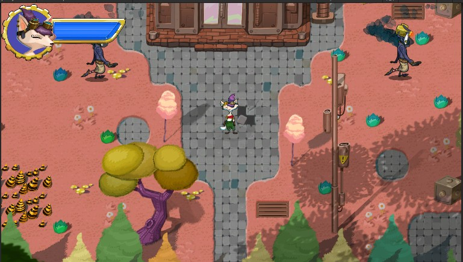
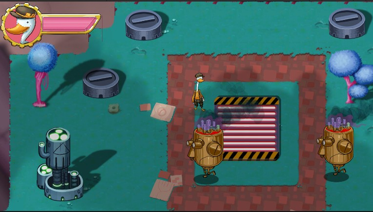
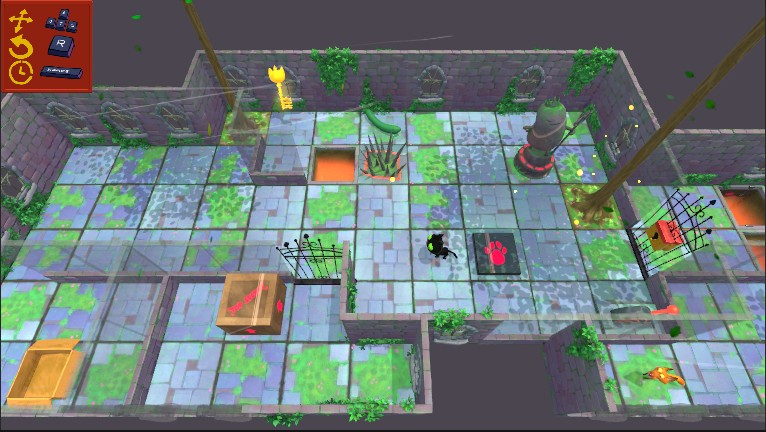
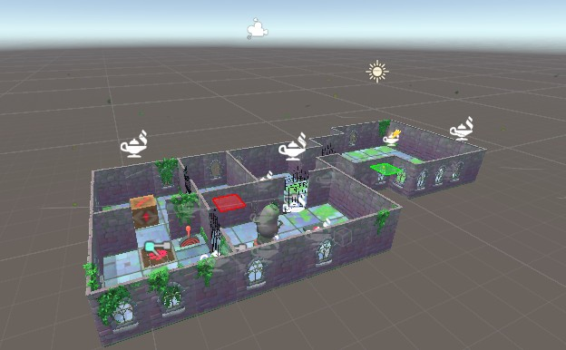
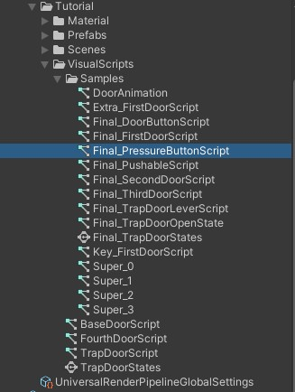

## Unity Learn

### 루비의 모험: 2D 초급자용 따라하기

#### 에셋 다운로드

- Unity Learn | 2D Beginner: Adventure Game Complete Project | URP 사용가능
- [링크](https://assetstore.unity.com/packages/essentials/tutorial-projects/unity-learn-2d-beginner-adventure-game-complete-project-urp-271239)

#### 샘플 테스트

- Scenes > Final이 세 가지 씬 테스트 실행

    

    

#### 메인 캐릭터 및 스크립트 작성

- [이미지](https://connect-prd-cdn.unity.com/20190206/learn/images/7d1c06b8-7c73-44b4-8c41-3246b3ce8427_image4.png) 다운로드 에셋에 추가

- 씬 이름을 "MainScene"으로 저장
- 프로젝트에 에셋 임포트

    - Art > Sprites로 파일을 드래그 앤 드롭하면 Unity에서 해당 파일을 프로젝트 폴더에 복사
    - 프로젝트가 2D 템플릿으로 생성되었으므로 이미지는 스프라이트로 자동 임포트

#### 작업 중 생각

- 2D 맴게임은 흥미가 없음 -> PASS
- Unity Playground 역시 동일

### 고양이 클라이브와 비밀의 지하실

- 비주얼 스크립트 활용 학습
- Unity Learn | Visual Scripting Tutorial | URP 애셋 추가

#### 시작하기 전

- 비주얼 스크립팅 인터페이스와 기본 원칙, 알아야 할 용어를 다룸
    - 이름이 주어진 노드를 퍼지 파인더에서 찾아 비주얼 스크립트에 추가
    - 게임 오브젝트(Script Machine)에서 간단한 비주얼 스크립트를 만들고 실행
    - 비주얼 스크립트에서 변수와 변수 값을 생성하고 조정
    - 비주얼 스크립트에 브랜칭을 적용

- 클라이브의 지하실 탐험

    - Assets > VisualScriptingTutorial > CompleteGame > Scenes > SampleScene으로 이동하여 씬 오픈
    - 테스트

    

#### 비주얼 스크립트 구성

- 요약
    - 비주얼 스크립트에서 유닛을 그룹화
    - 그룹을 사용하여 비주얼 스크립트에 제목과 코멘트를 추가
    - 다른 비주얼 스크립트에서 호출할 수 있는 슈퍼 유닛을 만들고 편집
    - Graph Inspector에서 슈퍼 유닛에 대한 입력과 출력을 지정

- 첫 번째 레벨을 플레이하면서, 문이 애니메이션이나 시각 효과와 함께 열리고 닫히는 것 확인

    - Assets > VisualScriptingTutorial > Tutorial > Scenes > TutorialScene을 선택

    

    - 비주얼 스크립트가 포함된 다음 폴더를 사용
        - 작업 스크립트: VisualScripts(프로젝트 창: Assets > VisualScriptingTutorial > Tutorial > VisualScripts)
        - 샘플 및 예제: VisualScripts 아래의 Samples 하위 폴더 

        

    